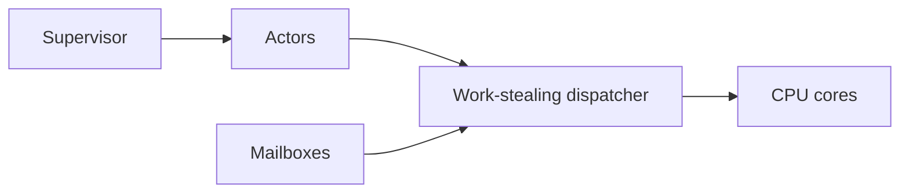

# Actor Model - Professional

An actor runtime combines scheduling, mailboxes, failure boundaries, naming, placement, and remote delivery.



## Real internals

- Erlang/OTP uses lightweight BEAM processes, reduction-based preemption, links, monitors, and supervision trees.
- Akka/Pekko dispatchers run mailbox batches on executors; cluster sharding coordinates entity placement and passivation.
- Microsoft Orleans uses virtual actors, activation, directory lookup, and grain persistence.
- Pony combines actors with reference capabilities to make data-race freedom a type property.

At 10x load, mailbox age and dispatcher starvation dominate. At 100x, placement churn, remote serialization, and supervision storms amplify failure. Dashboard runnable actors, mailbox age/size, processing time, restarts, dead letters, dispatcher utilization, and remote retransmits.

## Design and operations checklist

- Bound mailboxes and define overload behavior.
- Separate blocking work from actor dispatchers.
- Specify identity, placement, ordering, and restart semantics.
- Test supervision storms and rolling-version compatibility.
- Provide drain, quarantine, rebalance, and replay controls.

```text
actor safety = private state + serialized handling
system safety = bounded mailboxes + explicit failure policy
```

## Further reading

- Hewitt, Bishop, and Steiger, *A Universal Modular Actor Formalism*.
- Armstrong, *Programming Erlang* and the OTP design principles.
- Akka/Pekko dispatcher and cluster-sharding documentation.

## Test yourself

1. How would you prevent a restart storm from starving healthy actors?
2. What must remain stable while a virtual actor moves nodes?
3. When is a channel pipeline simpler than actors?
