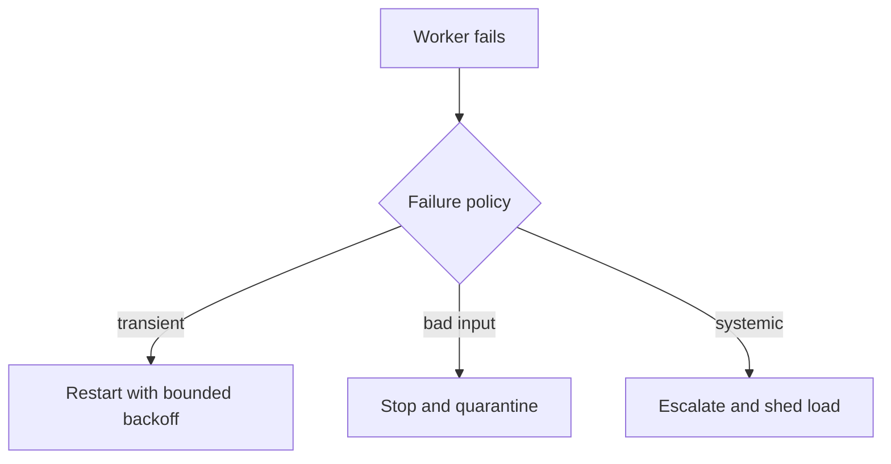

# Actor Model - Senior

Actors move concurrency risk into mailboxes, supervision, ordering, and distributed placement.

Use bounded mailboxes, dead-letter monitoring, explicit restart limits, and idempotent message handlers. Remember that messages from different senders may interleave. During cluster sharding, entity movement can overlap retries; use stable identities and deduplicate effects.

Test poison messages, slow actors, node loss, split brain, passivation, and restart with a full mailbox. Monitor mailbox age rather than only count.

Continue to [`professional.md`](professional.md).

## Test yourself

1. When should supervision restart versus stop an actor?
2. Why is sender-local order insufficient for global order?
3. Which metric exposes a slow actor earliest?
