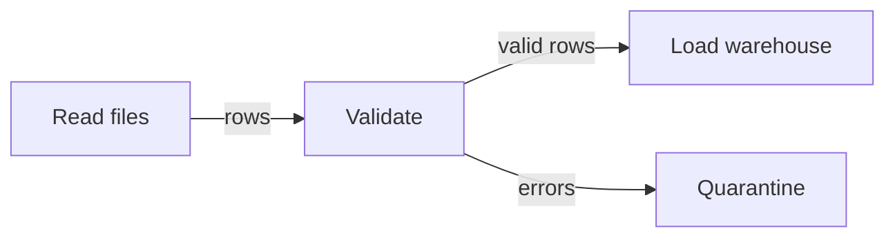

# CSP - Junior

CSP treats each stage as a sequential process. Processes coordinate by sending values through channels instead of sharing writable state.

For an ETL pipeline, start each stage with one input and one output. Use bounded channels so a slow warehouse writer makes upstream stages wait. Only the sender closes its output; receivers keep reading until closed.

Continue to [`middle.md`](middle.md).

## Test yourself

1. How does a bounded channel create backpressure?
2. Who should close a channel?
3. Why is each stage easier to test as sequential code?
