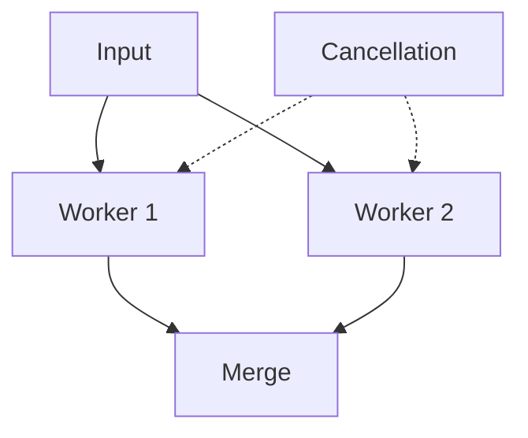

# CSP - Middle

Real pipelines need fan-out, fan-in, cancellation, timeouts, and a way to wait on several events.

In Go, pass a `context.Context` through every stage and `select` between data, cancellation, and timeout. Close output after all workers finish, not when the first worker exits. Keep channel capacity small and measured; a large buffer delays backpressure rather than solving overload.

Continue to [`senior.md`](senior.md).

## Test yourself

1. Why must fan-in wait for every producer before closing?
2. What does `select` add to a single receive?
3. Why can a large buffer hide a failing sink?
