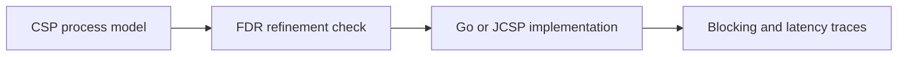

# CSP - Professional

CSP provides an algebra for composition; runtime channels are only one implementation of its events and synchronization.



## Real internals

- Hoare's CSP models prefix, choice, parallel composition, hiding, traces, failures, and divergences.
- FDR checks refinement and can find deadlock or livelock counterexamples.
- Go channels use `hchan`, send/receive wait queues, `sudog` records, and scheduler parking.
- Kotlin coroutines implement suspending channels and structured cancellation above JVM continuations.

At scale, scheduler run queues, channel contention, allocation, and cancellation fan-out become bottlenecks. Dashboard blocked duration by channel, runnable tasks, buffer occupancy, select latency, and leaked-task count. Keep a topology dump and goroutine/task profile in the incident runbook.

## Design and operations checklist

- Specify safety, liveness, close, and cancellation properties.
- Model-check critical topologies before optimization.
- Bound channels and parent every concurrent task.
- Benchmark contention and scheduler behavior on target runtimes.
- Preserve a simple sequential fallback for diagnosis.

```text
safety: nothing bad happens
liveness: useful progress eventually happens
```

## Further reading

- C. A. R. Hoare, *Communicating Sequential Processes*.
- Roscoe, *The Theory and Practice of Concurrency*.
- Go runtime source: `runtime/chan.go`.

## Test yourself

1. How would failures-divergences refinement expose livelock?
2. What runtime evidence distinguishes blocked I/O from channel deadlock?
3. When should a CSP topology be replaced by a queue or state machine?
