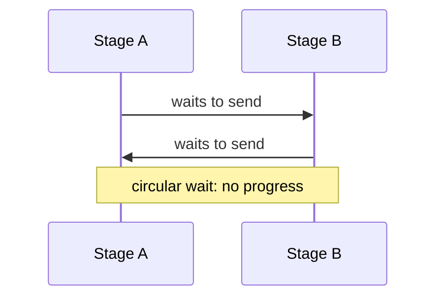

# CSP - Senior

CSP code can still deadlock, leak blocked processes, or starve a ready branch.

Define a channel topology before implementation. Prove that each blocked send can eventually meet a receive, every process observes cancellation, and every output has exactly one closer. Use structured concurrency so child lifetimes cannot escape their parent.

Monitor blocked goroutines/tasks, channel occupancy, stage latency, and cancellation time. Inject sink stalls and early consumer exits; these reveal leaks faster than happy-path load tests.

Continue to [`professional.md`](professional.md).

## Test yourself

1. How can a pipeline leak after a downstream stage exits?
2. What topology creates circular wait?
3. Which invariant gives a channel one safe closer?
