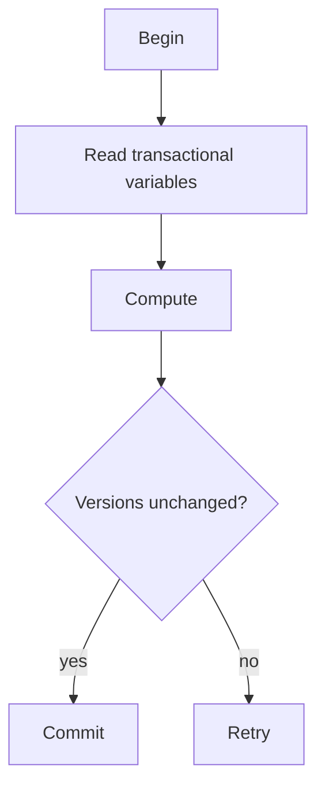

# STM - Middle

An STM tracks a read set and write set, validates versions, then publishes writes atomically.

In Clojure, use `dosync` and `alter` for coordinated refs; use atoms for one independent value. In Haskell, `retry` blocks until a read transactional variable changes, while `orElse` composes alternatives. Keep the block short and move warehouse or object-store I/O after commit.

Continue to [`senior.md`](senior.md).

## Test yourself

1. What information is in the read and write sets?
2. Why is `retry` better than busy waiting?
3. When is an atom simpler than STM?
