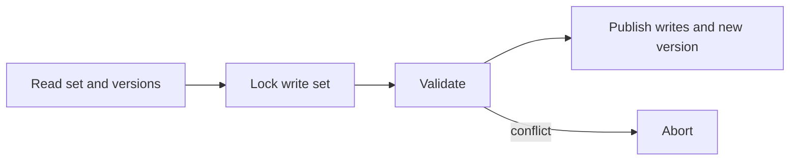

# STM - Professional

An STM implementation defines versioning, validation, commit locking, contention management, opacity, and memory reclamation.



## Real internals

- TL2 uses a global version clock, versioned locks, read-set validation, and commit-time write locking.
- GHC STM integrates transactional variables with the runtime; `retry` records dependencies and parks efficiently.
- Clojure refs use multiversion histories and commute-aware updates under `dosync`.
- Intel TSX provides hardware transactional memory but may abort for capacity, interrupts, or unsupported instructions.

At 10x contention, abort work and cache invalidation dominate. Large transactions can overflow HTM capacity or make software validation linear in read-set size. Dashboard abort causes, retries, read/write-set sizes, commit latency, fallback-lock use, and starvation.

## Design and operations checklist

- State isolation and opacity guarantees precisely.
- Keep irrevocable effects outside retryable regions.
- Bound retries and define a fallback path.
- Benchmark skewed access and transaction-size distributions.
- Test weak memory, exceptions, and process cancellation.

```text
STM wins when conflicts are rare and composition matters
STM loses when hot state makes useful work repeatedly abort
```

## Further reading

- Dice, Shalev, and Shavit, *Transactional Locking II*.
- Harris et al., *Composable Memory Transactions*.
- GHC user guide and runtime source for STM.

## Test yourself

1. What property does opacity add for aborted transactions?
2. How would you select a contention manager under skew?
3. What signals justify enabling a global-lock fallback?
