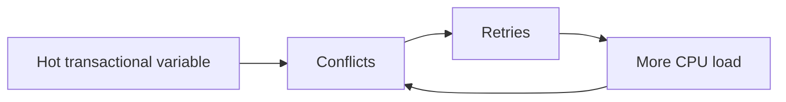

# STM - Senior

STM trades lock management for optimistic conflicts. Hot variables can cause repeated aborts, wasted CPU, unfairness, and retry storms.

| Symptom | Action |
|---|---|
| high abort ratio | partition hot state |
| long transactions | compute outside, validate inside |
| writer starvation | use contention management or a lock |
| large read sets | narrow transaction scope |
| repeated effects | move I/O after commit with an outbox |

Track commits, aborts by cause, retries per transaction, transaction duration, and hottest variables. Compare with a mutex baseline; STM is not automatically faster.

Continue to [`professional.md`](professional.md).

## Test yourself

1. How does a hot variable create a retry storm?
2. Which metric tells you STM is wasting CPU?
3. When should you replace STM with a lock or partitioning?
