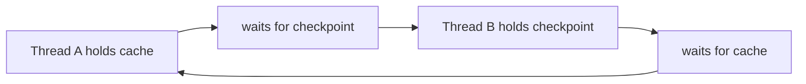

# Mutex - Middle

With multiple locks, define one global acquisition order. A cycle in the wait graph is a deadlock.

Choose one mutex for related state, sharded locks for independent keys, and an RW lock only after measuring read-heavy contention. Avoid calling unknown code while locked. Use timed acquisition for diagnosis, not as a correctness strategy.

Continue to [`senior.md`](senior.md).

## Test yourself

1. Which four conditions make deadlock possible?
2. How does global lock order remove circular wait?
3. When can an RW lock perform worse than a mutex?
