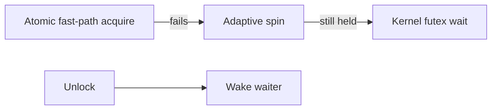

# Mutex - Professional

Mutex design spans atomic fast paths, kernel parking, fairness policy, ownership, and memory-order guarantees.



## Real internals

- Linux futexes keep uncontended locking in user space and ask the kernel to park only on contention.
- Go `sync.Mutex` switches toward starvation mode after prolonged wait to limit tail latency.
- Java `ReentrantLock` builds on AbstractQueuedSynchronizer's CLH-style wait queue.
- PostgreSQL lightweight locks coordinate shared-memory structures; heavyweight locks represent transactional conflicts.

Dashboard acquisition p50/p99, hold time, waiters, parks, timeouts, and lock-owner stacks. A runbook captures profiles before restart, reduces concurrency, and rolls back recent lock-topology changes.

## Design and operations checklist

- Document protected invariants and lock order.
- Set hold-time and contention budgets.
- Test cancellation, panic, and owner death behavior.
- Benchmark fairness and NUMA effects.
- Keep a simpler baseline and rollback path.

```text
uncontended: atomic fast path
contended: spin briefly, park safely, wake fairly enough
```

## Further reading

- Linux futex manual and kernel futex source.
- Mellor-Crummey and Scott, *Algorithms for Scalable Synchronization*.
- OpenJDK AbstractQueuedSynchronizer source.

## Test yourself

1. How would you choose spin duration on a mixed-core machine?
2. What metrics distinguish unfairness from long holders?
3. When should a library expose a mutex versus hide it?
