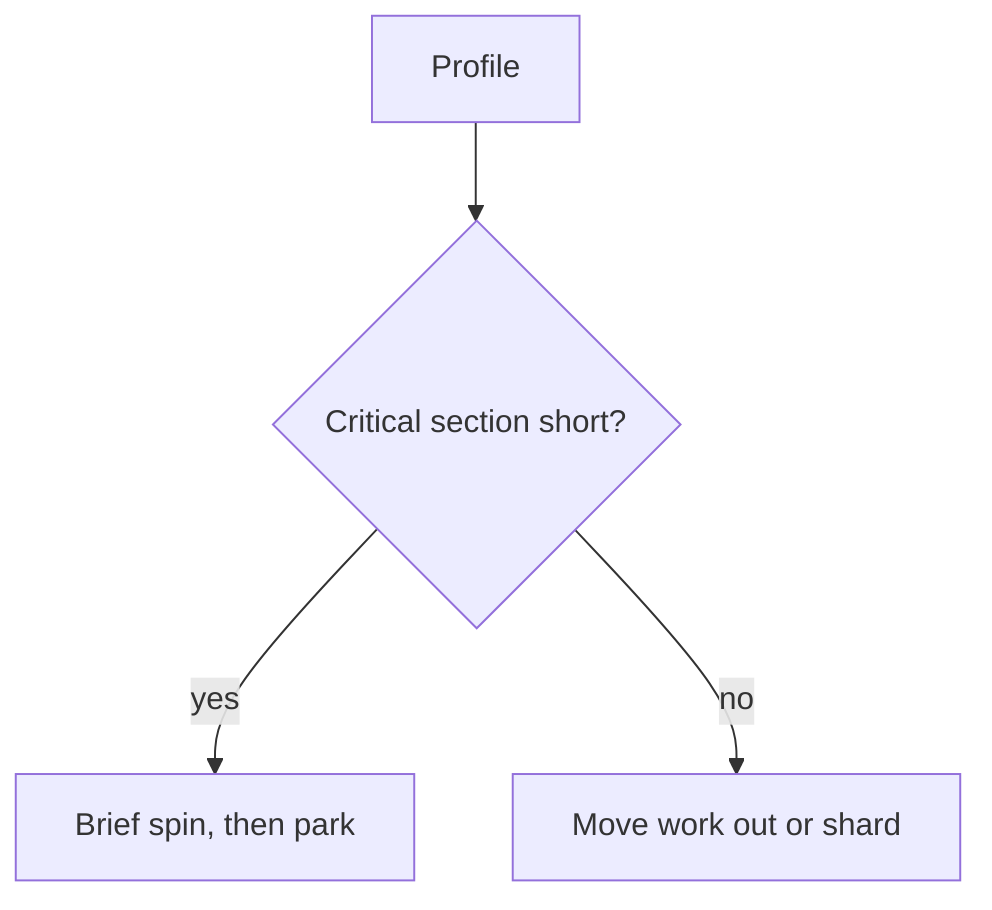

# Mutex - Senior

Lock performance depends on hold time, waiter count, fairness, scheduler behavior, and cache-line movement.

Linux `perf lock`, Go block/mutex profiles, JVM Flight Recorder, and thread dumps reveal contention. Watch for lock convoys and priority inversion. Use priority inheritance where real-time scheduling requires it. Compare lock sharding, immutable snapshots, and ownership transfer before lock-free code.

Continue to [`professional.md`](professional.md).

## Test yourself

1. What evidence identifies a lock convoy?
2. How does priority inheritance address inversion?
3. Why can sharding hurt under skewed keys?
