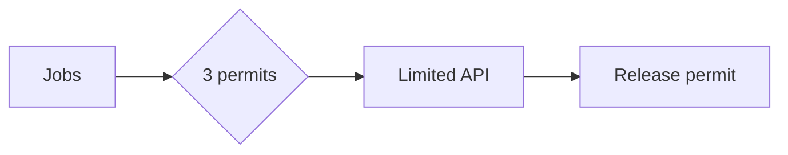

# Semaphore

> A semaphore uses permits to bound how many operations may use a resource concurrently.

| Level | Guide | You are done when |
|---|---|---|
| Junior | [Start](junior.md) | You can bound concurrent work. |
| Middle | [Apply](middle.md) | You can avoid permit leaks. |
| Senior | [Operate](senior.md) | You can handle fairness and overload. |
| Professional | [Design](professional.md) | You can govern resources across workloads. |

**Practice rule:** Acquire immediately before use and release exactly once in guaranteed cleanup.

## Related

[Mutex](../01-mutex/README.md) | [Condition variables](../03-condition-variables/README.md)
