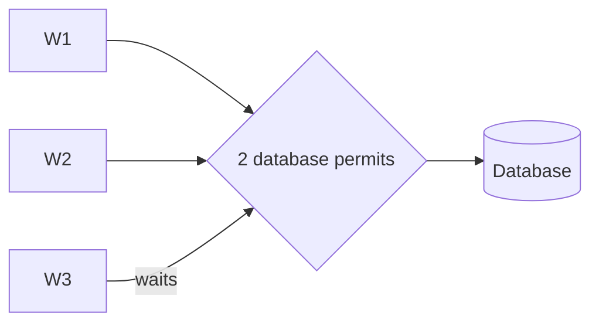

# Semaphore - Junior

A counting semaphore starts with `N` permits. Each worker acquires one before using a limited resource and releases it afterward.

Use it to cap warehouse connections, API requests, or concurrent file uploads. Put release in `finally`, `defer`, or an async context manager. A semaphore limits concurrency; it does not guarantee a target requests-per-second rate.

Continue to [`middle.md`](middle.md).

## Test yourself

1. How is a semaphore different from a mutex?
2. What happens when no permit remains?
3. Why must release be in cleanup code?
