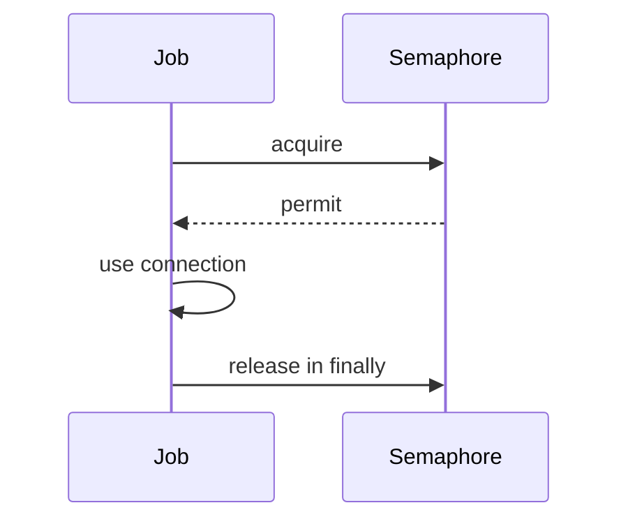

# Semaphore - Middle

Cancellation between acquire and release is the main permit-leak risk. Treat a permit as an owned resource.

Set the limit from downstream capacity, then load-test it. Weighted semaphores fit jobs with different costs, but large requests may starve behind small ones. Combine a semaphore with a bounded input queue so waiting jobs do not consume unlimited memory.

Continue to [`senior.md`](senior.md).

## Test yourself

1. Where can cancellation leak a permit?
2. Why pair a semaphore with a bounded queue?
3. What fairness issue affects weighted permits?
