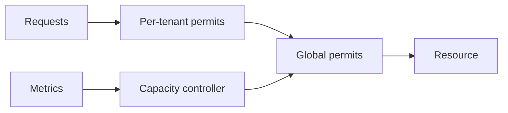

# Semaphore - Professional

At system level, semaphores implement admission control and bulkheads; their limit is a policy tied to resource saturation.



## Real internals

- Dijkstra's P/V operations established the counting-semaphore invariant.
- Linux POSIX `sem_t` commonly combines an atomic count with futex waiting.
- Java `Semaphore` uses AbstractQueuedSynchronizer and offers fair or non-fair acquisition.
- Tokio `Semaphore` supports owned and multi-permit guards with cancellation-aware async waits.

At 10x load, wait queues and timeouts rise; at 100x, retry amplification and memory consumed by waiters become the outage. Dashboard permits, wait age, cancellation, fairness by tenant, and downstream utilization. Runbooks first reject excess work, then adjust limits only with saturation evidence.

## Design and operations checklist

- Derive capacity from a measured bottleneck.
- Bound waiters and assign deadlines.
- Make acquisition cancellation-safe and release ownership explicit.
- Test weighted starvation and tenant skew.
- Compose with rate limits and circuit breakers deliberately.

```text
semaphore limits in-flight work
rate limiter limits work per time
```

## Further reading

- Dijkstra, *Cooperating Sequential Processes*.
- OpenJDK `Semaphore` and AQS source.
- Tokio semaphore source and cancellation-safety documentation.

## Test yourself

1. How would you tune permits from a latency saturation curve?
2. What prevents limit reduction from violating accounting?
3. When should excess work wait versus fail fast?
