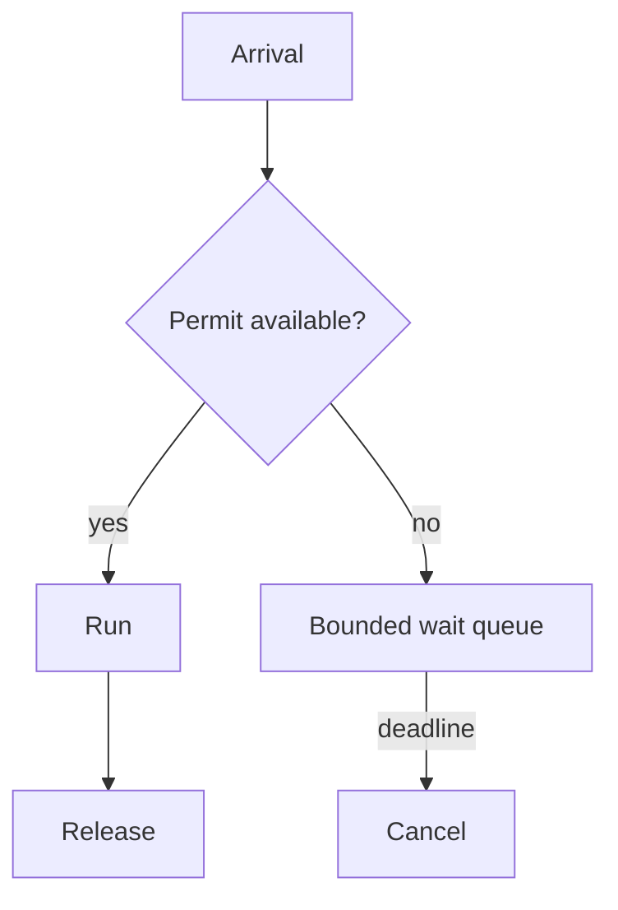

# Semaphore - Senior

A safe semaphore preserves `available + acquired = capacity`, even through timeout, cancellation, panic, and shutdown.

Monitor wait duration, active permits, queue size, timeout rate, and downstream saturation. Use separate tenant and global limits to prevent noisy neighbors. Avoid dynamically reducing capacity below permits already held; phase changes or use a controller with explicit debt.

Continue to [`professional.md`](professional.md).

## Test yourself

1. Which invariant detects leaked permits?
2. How do per-tenant and global limits compose?
3. Why can waking every waiter cause a thundering herd?
