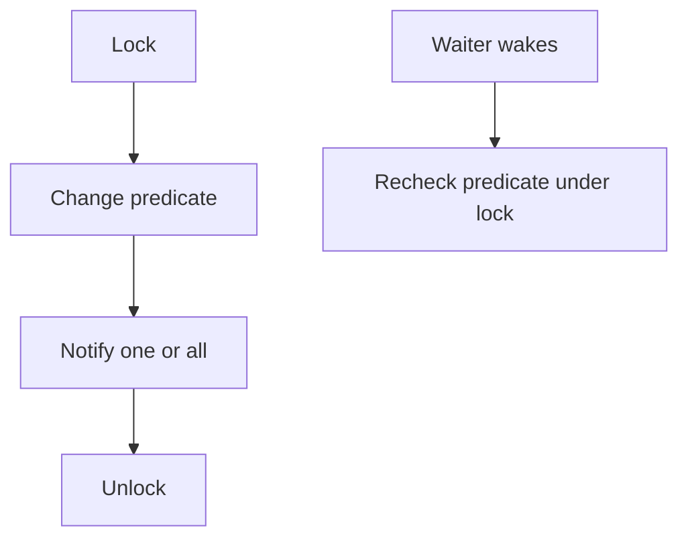

# Condition Variables - Middle

Lost wakeups happen when predicate checks and sleeping are not coordinated under one mutex.

For a bounded in-memory ingestion buffer, use `not_empty` for consumers and `not_full` for producers. Notify one when one unit of work becomes possible; notify all for global state transitions such as shutdown. A timeout is a deadline check, not proof the predicate is false forever.

Continue to [`senior.md`](senior.md).

## Test yourself

1. When is `notify_all` required?
2. How does one mutex prevent a lost wakeup?
3. Why must a timeout recompute remaining time?
