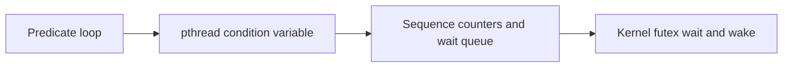

# Condition Variables - Professional

Condition variables implement monitor-style waiting while deliberately allowing predicates to change before a waiter runs.



## Real internals

- Mesa semantics make signal a hint; the awakened thread competes to reacquire the mutex and must recheck.
- glibc `pthread_cond_t` uses sequence accounting plus futex operations to avoid lost signals.
- Java `Condition` uses separate condition queues that transfer waiters to an AQS synchronization queue.
- Go `sync.Cond` uses a runtime notify list with ticket counters.

At scale, broadcast storms and lock reacquisition dominate. Dashboard blocked wait time, wake-to-progress ratio, waiters, mutex contention, and shutdown duration. Capture wait stacks before restarting a wedged service.

## Design and operations checklist

- Write the predicate before the waiting code.
- Protect predicate changes and checks with one mutex.
- Define signal, broadcast, timeout, cancellation, and destruction rules.
- Prefer a typed higher-level primitive in public APIs.
- Test wake-before-wait and shutdown races.

```text
wait: while !predicate { atomically unlock, sleep, relock }
signal changes scheduling; shared state determines truth
```

## Further reading

- Lampson and Redell, *Experience with Processes and Monitors in Mesa*.
- POSIX condition-variable specification and glibc source.
- OpenJDK AQS and `ConditionObject` source.

## Test yourself

1. How do sequence counters prevent a signal from disappearing?
2. Why can broadcast reduce throughput despite improving liveness?
3. What API would hide a condition variable for safer use?
