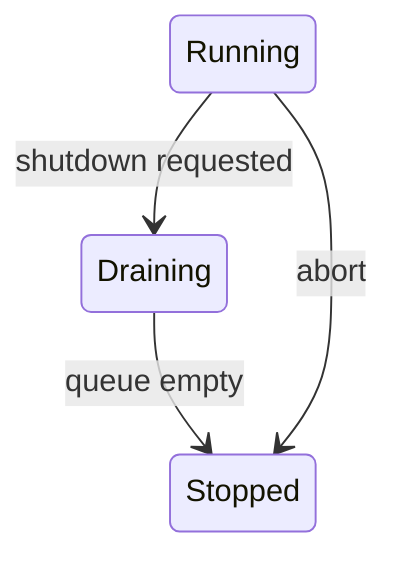

# Condition Variables - Senior

Correct coordination must handle startup, shutdown, cancellation, multiple predicates, and object destruction.

Include shutdown in every wait predicate, set it under the mutex, then broadcast. Ensure no waiter can access a destroyed condition variable. Prefer a queue, latch, barrier, or future when it directly expresses the protocol; raw condition variables expose too much lifecycle state.

Track waiting threads, wakeups per useful transition, wait duration, and herd size. Stress missed timing windows with randomized scheduling.

Continue to [`professional.md`](professional.md).

## Test yourself

1. How does shutdown release every waiter?
2. What makes condition-variable destruction safe?
3. When is a latch clearer than a condition variable?
