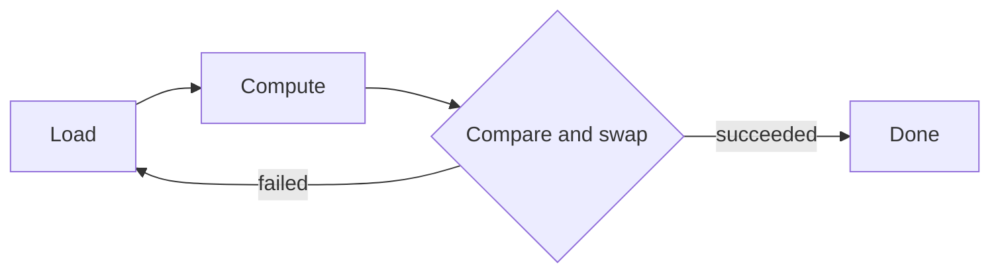

# Atomic Operations

> An atomic operation appears indivisible and can establish visibility between threads.

| Level | Guide | You are done when |
|---|---|---|
| Junior | [Start](junior.md) | You can choose an atomic for one value. |
| Middle | [Apply](middle.md) | You can explain acquire and release. |
| Senior | [Operate](senior.md) | You can handle ABA, reclamation, and contention. |
| Professional | [Design](professional.md) | You can audit memory-model-dependent code. |

**Practice rule:** Prefer a lock unless the atomic design has a written correctness argument and measured benefit.

## Related

[Shared memory](../../01-models/01-shared-memory/README.md) | [Mutex](../01-mutex/README.md)
