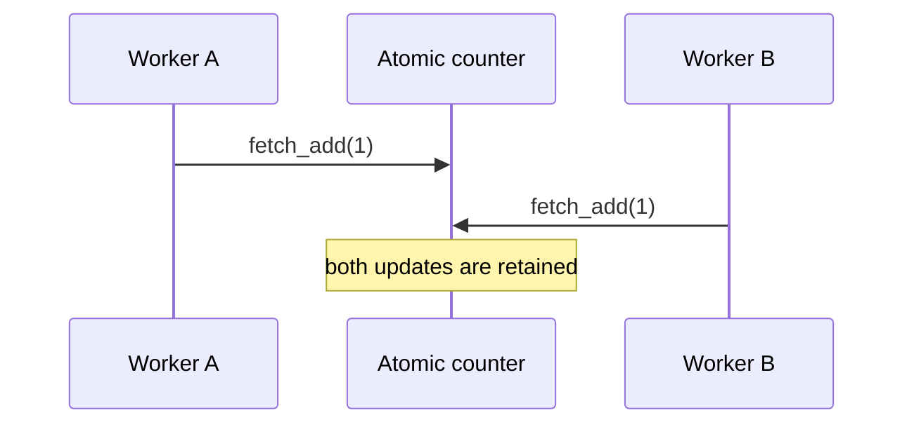

# Atomics - Junior

An atomic counter updates as one indivisible operation, so concurrent metrics increments are not lost.

Use atomics for independent counters, flags, and simple state transitions. They do not make a multi-field invariant atomic. If count and total must change together, use a lock or one immutable snapshot.

Continue to [`middle.md`](middle.md).

## Test yourself

1. Why is ordinary `counter++` unsafe?
2. Which state fits one atomic value?
3. Why do two atomics not create one transaction?
