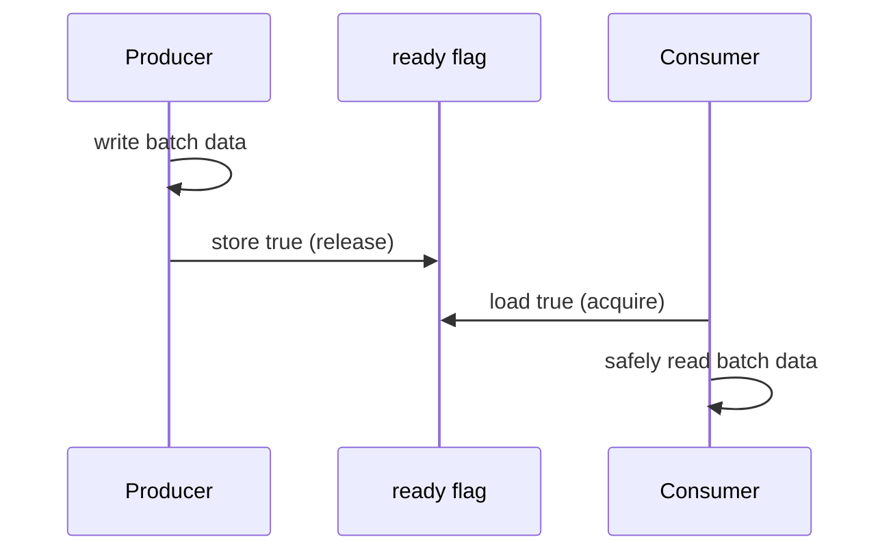

# Atomics - Middle

Memory order controls which surrounding reads and writes become visible, not only whether the atomic itself tears.

Use relaxed ordering for independent statistics. Use release/acquire to publish initialized data. Start with the language default, then weaken ordering only with a happens-before proof and a benchmark. CAS loops must retry from the newly observed value.

Continue to [`senior.md`](senior.md).

## Test yourself

1. What does release/acquire publish?
2. When is relaxed ordering appropriate?
3. Why must a CAS loop refresh its expected value?
