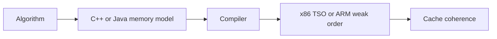

# Atomics - Professional

Atomic code sits at the contract boundary between algorithm, compiler memory model, CPU ordering, cache coherence, and reclamation.



## Real internals

- C++11 atomics define relaxed, acquire, release, acq_rel, and sequentially consistent orderings.
- Java JSR-133 and `VarHandle` define volatile, acquire/release, and opaque access modes.
- ARMv8 uses load-acquire/store-release and barriers; x86 TSO is stronger but not a language-level proof.
- LMAX Disruptor sequences and Linux RCU show specialized designs built around ordering and reclamation.

At scale, a single atomic cache line becomes a serialization point. CAS retry storms and delayed epoch reclamation can consume CPU and memory. Dashboard retry rate, coherence/cache misses, operation tails, stalled epochs, and fallback usage. Keep a mutex implementation available for rollback and comparison.

## Design and operations checklist

- Name every linearization point and progress guarantee.
- Justify every ordering weaker than sequential consistency.
- Specify reclamation and thread-exit behavior.
- Model-check bounded executions and test ARM hardware.
- Require measured benefit over the locked baseline.

```text
atomicity != ordering != visibility
lock-free != wait-free != faster
```

## Further reading

- JSR-133 specification and cookbook.
- Batty et al., *Mathematizing C++ Concurrency*.
- Herlihy, *Wait-Free Synchronization*.

## Test yourself

1. How would you audit a release sequence across several threads?
2. Why can x86 testing miss an ARM failure?
3. What production signal reveals stalled epoch reclamation?
