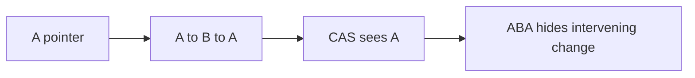

# Atomics - Senior

Lock-free means system-wide progress, not low latency for every thread. Reclamation and contention are part of correctness.

Use tagged pointers to expose ABA and hazard pointers, epochs, or RCU before freeing nodes. Pad hot counters to avoid false sharing. Measure CAS failures, retry depth, cache misses, p99 operation latency, and unreclaimed memory. Validate with TSan plus tools such as Rust Loom, Relacy, or a model checker.

Continue to [`professional.md`](professional.md).

## Test yourself

1. Why is ABA more than equal values?
2. What progress guarantee does lock-free provide?
3. How can reclamation make a correct CAS unsafe?
