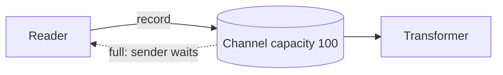

# Channels - Junior

Channels carry values between concurrent tasks. An unbuffered channel synchronizes sender and receiver; a buffered channel allows limited decoupling.

Use a bounded channel between ETL stages. Send immutable values or transfer ownership. The sender closes after producing all values; the receiver drains until closed. Never use closure to mean “one worker finished” when other senders remain.

Continue to [`middle.md`](middle.md).

## Test yourself

1. How do buffered and unbuffered channels differ?
2. Who should close a channel?
3. What does a full bounded channel do?
