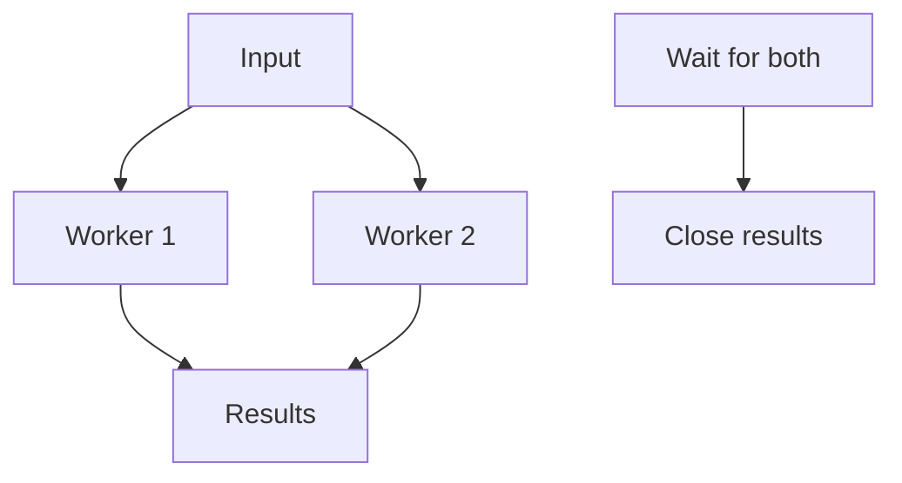

# Channels - Middle

Fan-out distributes work; fan-in merges results. Lifecycle coordination matters as much as data flow.

Use a task group or wait group to close results only after all senders exit. Select between send/receive, cancellation, and deadlines. Size the buffer from measured burst tolerance; it cannot fix a sustained rate mismatch.

Continue to [`senior.md`](senior.md).

## Test yourself

1. Why must fan-in wait before closing output?
2. How does cancellation unblock a sender?
3. What can channel occupancy tell you?
