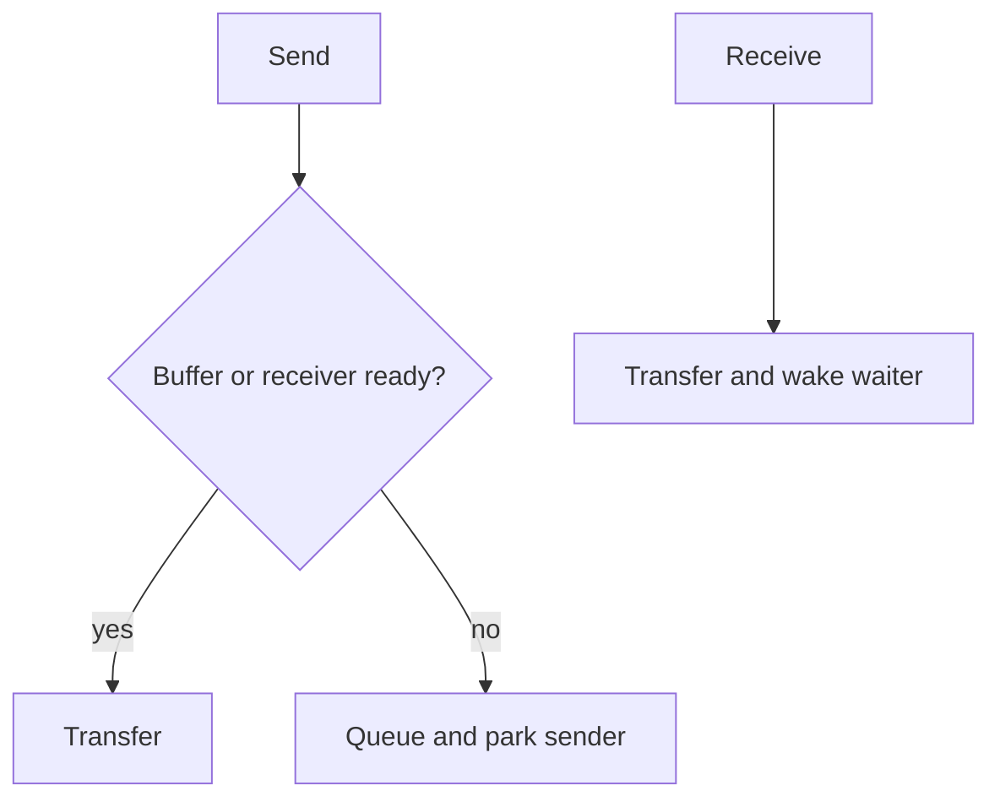

# Channels - Professional

A channel API defines capacity, wake policy, ownership, closure, cancellation, fairness, and memory-order guarantees.



## Real internals

- Go `hchan` contains a ring buffer, indices, a lock, and `sendq`/`recvq` wait lists represented by `sudog` records.
- Tokio offers bounded `mpsc`, `broadcast`, `watch`, and `oneshot`, each with different loss and ownership semantics.
- Crossbeam channels use specialized array/list flavors and parking for Rust threads.
- Clojure `core.async` implements channels and `alts!` through state-machine transformations, not OS threads per task.

At 10x load, contention and parked tasks rise; at 100x, buffer memory and cancellation scans dominate. Dashboard send/receive tails, occupancy, waiter counts, drop or lag metrics, allocations, and leaked tasks. Runbooks need producer pause, channel drain, consumer restart, and data-loss accounting.

## Design and operations checklist

- Pick semantics before selecting a library channel type.
- Bound capacity and define overload behavior.
- Give closure one owner and cancellation to every waiter.
- Test fairness, shutdown, and receiver disappearance.
- Benchmark against a mutex queue or direct call.

```text
channel capacity is a latency and memory budget
close is a lifecycle event, not a broadcast value
```

## Further reading

- Go runtime source: `runtime/chan.go`.
- Tokio synchronization source and channel documentation.
- Vyukov, *Bounded MPMC Queue*.

## Test yourself

1. How do channel semantics change when values may be dropped?
2. What wake policy balances throughput and fairness?
3. When is a direct call or queue simpler than a channel?
