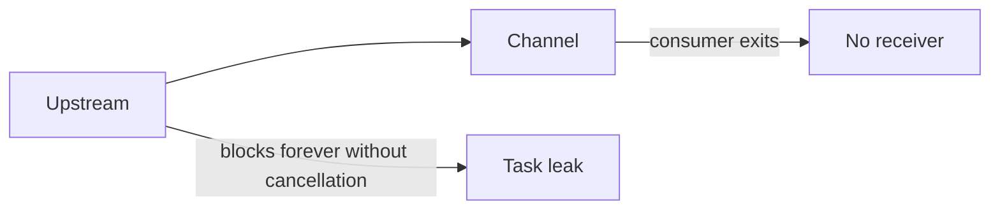

# Channels - Senior

Common failures are blocked-task leaks, send-after-close, silent drops, starvation, and buffers that hide overload.

Make channel ownership visible in API types. Propagate one cancellation signal through the full pipeline. Define whether overload blocks, drops, samples, or fails. Monitor occupancy, blocked duration, oldest item age, send/receive rates, drops, and live tasks.

For streaming ingestion, inject downstream stalls and verify upstream stops within a deadline without losing ownership of in-flight records.

Continue to [`professional.md`](professional.md).

## Test yourself

1. How does early consumer exit leak producers?
2. Which overload policy fits telemetry versus financial events?
3. Why is oldest-item age stronger than queue length alone?
