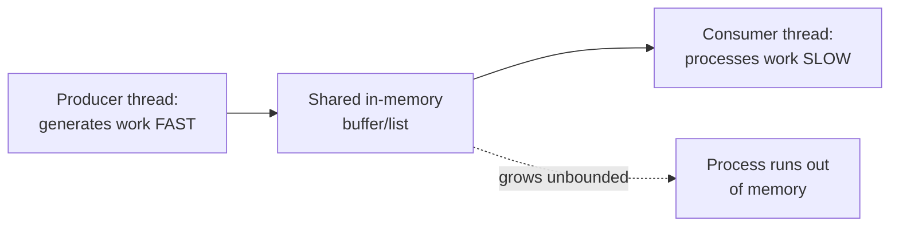
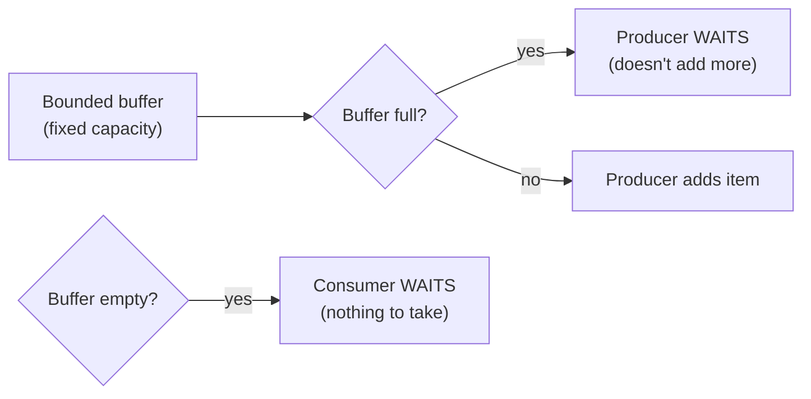

# Producer-Consumer — Junior

<!-- level-focus -->
At junior level, focus on this question:

> Why is an unbounded shared buffer between a fast producer and a slow
> consumer dangerous, within a single process?

---

## The shape of the problem

This is the exact same unbounded-queue risk from the Queue-Based Load
Leveling reliability pattern, just at the scale of two threads sharing
memory within one process instead of two services communicating over a
network — a fast producer and a slow consumer sharing an unbounded list
means that list just keeps growing, eventually exhausting the process's
memory.

## The fix: a bounded buffer with explicit wait conditions

A **bounded** buffer has a fixed maximum size — when full, the producer
must **wait** until the consumer makes room; when empty, the consumer
must wait until the producer adds something. This is the same
back-pressure principle from the Back-Pressure professional page, applied
at the smallest possible scale: two threads sharing memory, using a
condition variable (covered in `middle.md`) instead of a network protocol.

> 🎓 **Takeaway:** producer-consumer's bounded buffer is the in-process
> ancestor of every queue-based decoupling pattern covered elsewhere in
> this tree — the mechanism (wait when full, wait when empty) is
> identical in spirit; only the implementation tool (a condition variable
> vs. a network-level backpressure protocol) differs.

## Test yourself

1. Why does an unbounded shared buffer eventually cause an out-of-memory
   crash, given a sustained producer/consumer rate mismatch?
2. What must happen when a consumer tries to take from an empty buffer —
   what's the wrong (busy-wait) way to handle this, and why is it wasteful?
3. Why is this pattern considered the smallest-scale version of the
   Queue-Based Load Leveling reliability pattern?

Continue to [`middle.md`](middle.md).
