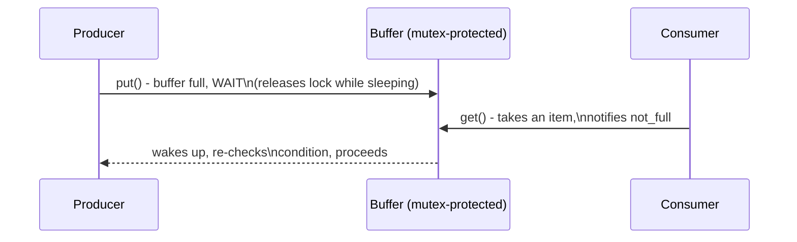
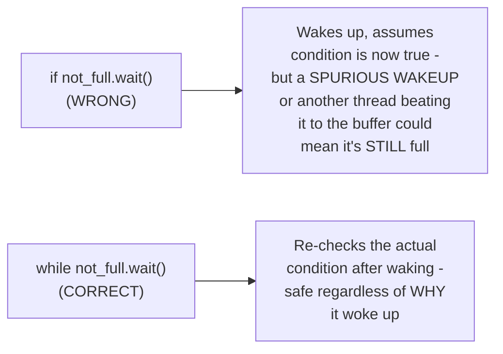

# Producer-Consumer — Middle

<!-- level-focus -->
At middle level, focus on this question:

> How do you implement a correct bounded buffer using a mutex and
> condition variable, without busy-waiting?

Prerequisite: [`junior.md`](junior.md).

---

## The condition variable pattern

```python
import threading

class BoundedBuffer:
    def __init__(self, capacity):
        self.capacity = capacity
        self.buffer = []
        self.lock = threading.Lock()
        self.not_full = threading.Condition(self.lock)
        self.not_empty = threading.Condition(self.lock)

    def put(self, item):
        with self.not_full:
            while len(self.buffer) >= self.capacity:
                self.not_full.wait()   # sleeps, releases lock, no busy-wait
            self.buffer.append(item)
            self.not_empty.notify()

    def get(self):
        with self.not_empty:
            while len(self.buffer) == 0:
                self.not_empty.wait()
            item = self.buffer.pop(0)
            self.not_full.notify()
            return item
```



## Why `wait()` in a `while` loop, not an `if`



`Condition.wait()` can wake up for reasons other than the specific
condition becoming true (a spurious wakeup, or another thread grabbing
the newly-available space first) — checking the condition in a `while`
loop (re-verify after waking, before proceeding) rather than a one-time
`if` is the standard, necessary defensive pattern for any condition
variable usage, in any language.

> 🎓 **Takeaway:** `wait()`/`notify()` lets a thread sleep without
> consuming CPU while waiting (unlike a busy-wait loop checking a
> condition repeatedly), and releases the lock while sleeping so other
> threads can make progress — but always re-check the actual condition
> in a loop after waking, never assume the wakeup means the condition is
> now definitely true.

## Test yourself

1. Why does `wait()` release the lock while the thread sleeps, rather
   than holding it the whole time?
2. Construct a scenario where using `if` instead of `while` around
   `wait()` would produce incorrect behavior.
3. Why does `put()` notify `not_empty` (not `not_full`) after adding an
   item, and why does `get()` notify the opposite condition?

Continue to [`senior.md`](senior.md).
