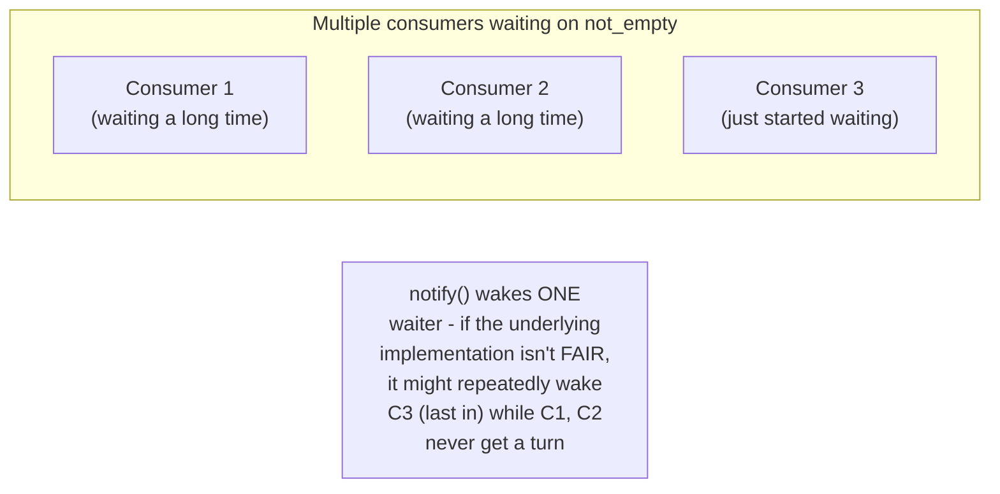
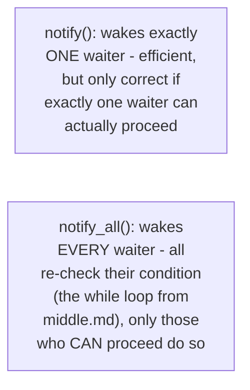

# Producer-Consumer — Senior

<!-- level-focus -->
At senior level, focus on this question:

> With multiple producers and consumers sharing one buffer, how can
> starvation occur, and how do you prevent it?

Prerequisite: [`middle.md`](middle.md).

---

## The starvation risk with multiple waiters



If the condition variable's wakeup order isn't **fair** (first-in,
first-out), a consumer that's been waiting the longest could
theoretically be starved indefinitely while newer waiters keep getting
woken first — most standard library implementations provide reasonable
fairness, but this is a real property to verify for any performance-
critical, high-contention producer-consumer system, rather than assume.

## Using `notify_all()` vs. `notify()` correctly with multiple waiters

```python
def put(self, item):
    with self.not_full:
        while len(self.buffer) >= self.capacity:
            self.not_full.wait()
        self.buffer.append(item)
        self.not_empty.notify()   # wakes only ONE waiting consumer

        # If multiple items were added, or multiple consumers COULD
        # proceed, notify_all() might be needed instead, depending on
        # exact semantics required
```



> 🎯 **Senior takeaway:** with multiple producers/consumers, choosing
> `notify()` (wake one) versus `notify_all()` (wake all, let them
> re-check) is a real correctness/performance trade-off — `notify()` is
> more efficient but can be wrong if your logic assumes exactly one
> waiter becomes eligible per notification, when in fact multiple could
> be; `notify_all()` is always safe (thanks to the `while`-loop
> re-check from `middle.md`) but wakes more threads than strictly
> necessary, at a real performance cost under high contention.

## Test yourself

1. Why can `notify()` (waking only one thread) be incorrect in a scenario
   where a single buffer change makes multiple waiting threads eligible
   to proceed?
2. Why is `notify_all()` always safe, given the `while`-loop condition
   re-check pattern from `middle.md`, even though it wakes more threads
   than needed?
3. Design a scenario with multiple producers and consumers where
   starvation of one specific consumer could realistically occur, and
   propose a fix.

Continue to [`professional.md`](professional.md) to see lock-free ring
buffers used in production for this exact pattern.
