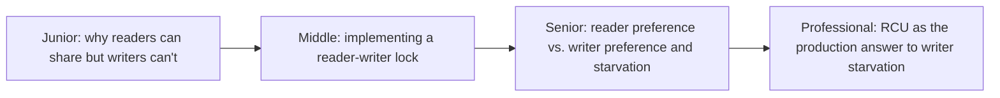
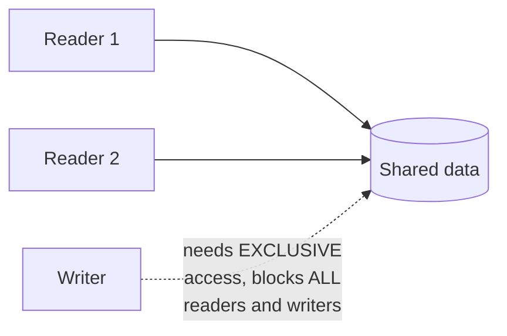

# Readers-Writers

> Many readers can safely access shared data simultaneously; a writer
> needs exclusive access. The pattern that generalizes into every
> reader-writer lock, MVCC system, and RCU mechanism covered elsewhere in
> this tree — this is where those ideas start, at the smallest scale.

## Choose a level

| Level | Guide | You are done when |
|---|---|---|
| Junior | [Why readers can share, writers can't](junior.md) | You can explain why concurrent reads are safe but a concurrent read+write isn't. |
| Middle | [Implementing a reader-writer lock](middle.md) | You can implement a basic reader-writer lock using a mutex and counters. |
| Senior | [Reader vs. writer preference](senior.md) | You can explain how a reader-preferring lock can starve writers indefinitely. |
| Professional | [RCU as the production answer](professional.md) | You can explain how RCU avoids the starvation trade-off entirely for read-mostly workloads. |

## Practice rule

Before choosing a reader-writer lock over a plain mutex, ask: "are reads
genuinely far more frequent than writes for this data?" If reads and
writes are roughly balanced, a reader-writer lock's added complexity
often isn't worth it over a simple mutex.

## Related

- [Locking & Concurrency Control](../../../../databases/transaction/09-locking-and-concurrency-control/README.md)
- [MVCC](../../../../databases/transaction/10-mvcc/README.md)
