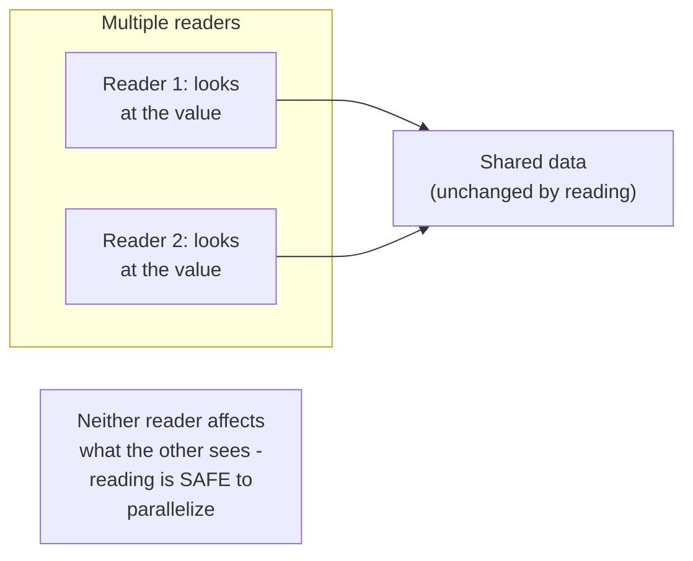
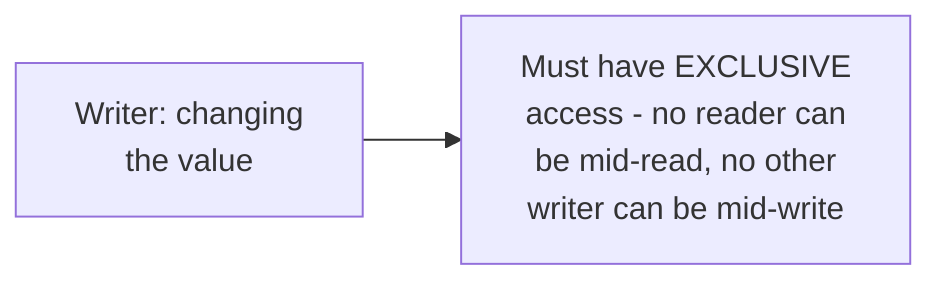

# Readers-Writers — Junior

<!-- level-focus -->
At junior level, focus on this question:

> Why can multiple readers safely access shared data at the same time,
> while a writer needs exclusive access?

---

## Reading doesn't change anything; writing does

Two threads reading the same value simultaneously never interfere with
each other — reading doesn't modify anything, so there's no possibility of
a race. This is why a plain mutex (only one thread at a time, whether
reading or writing) is unnecessarily restrictive for read-heavy
workloads: it serializes reads that could safely happen in parallel.

## A writer must not overlap with anyone

A writer changing the data **must** be the only thread touching it at
that moment — a reader reading concurrently could see a torn/partial
value (the exact torn-read risk from the Locking & Concurrency Control
junior page), and two writers overlapping could produce a lost update.

> 🎓 **Takeaway:** the readers-writers pattern exists specifically to
> exploit the fact that reads are naturally parallelizable while writes
> are not — a reader-writer lock lets many readers proceed simultaneously
> while still guaranteeing a writer gets fully exclusive access when it
> needs it.

## Test yourself

1. Why is it safe for two threads to read the same shared value
   simultaneously, but not safe for one to read while another writes?
2. Why would using a plain mutex (not a reader-writer lock) for a
   read-heavy workload be unnecessarily restrictive?
3. What specific problem could occur if a reader read a value while a
   writer was midway through changing it, with no synchronization at all?

Continue to [`middle.md`](middle.md).
