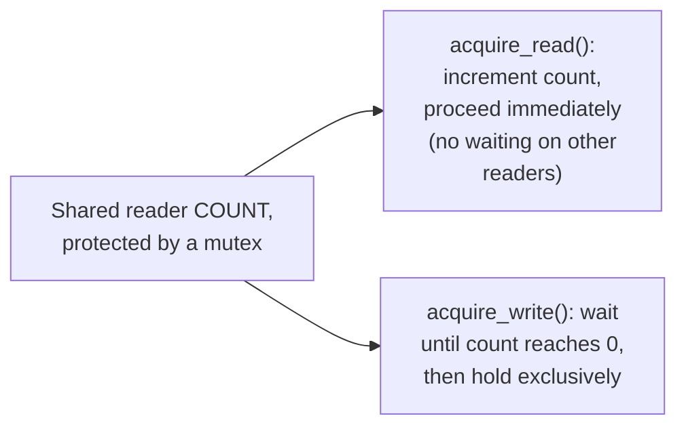

# Readers-Writers — Middle

<!-- level-focus -->
At middle level, focus on this question:

> How do you implement a reader-writer lock using just a mutex and a
> reader count?

Prerequisite: [`junior.md`](junior.md).

---

## A basic implementation

```python
import threading

class ReadWriteLock:
    def __init__(self):
        self._read_ready = threading.Condition(threading.Lock())
        self._readers = 0

    def acquire_read(self):
        with self._read_ready:
            self._readers += 1

    def release_read(self):
        with self._read_ready:
            self._readers -= 1
            if self._readers == 0:
                self._read_ready.notify_all()  # wake any waiting writer

    def acquire_write(self):
        self._read_ready.acquire()
        while self._readers > 0:
            self._read_ready.wait()   # wait until no readers remain

    def release_write(self):
        self._read_ready.notify_all()
        self._read_ready.release()
```



Readers only need to briefly hold the internal mutex to **increment/
decrement a shared counter** — the actual reading happens **without**
holding any lock, letting readers proceed fully in parallel. A writer
must wait until the reader count drops to zero, then holds the lock
exclusively for the duration of its write.

> 🎓 **Takeaway:** the reader count is the key data structure — it's what
> lets many readers proceed concurrently (each just briefly touches a
> counter) while giving a writer a precise signal for "is it safe for me
> to proceed exclusively yet."

## Test yourself

1. Why do readers only need to briefly hold the mutex (to update the
   counter), rather than holding it for the entire duration of their
   read?
2. What would go wrong if `acquire_write()` didn't wait for the reader
   count to reach zero before proceeding?
3. Trace what happens if a writer calls `acquire_write()` while 3 readers
   currently hold read access — does it block immediately, and when does
   it proceed?

Continue to [`senior.md`](senior.md).
