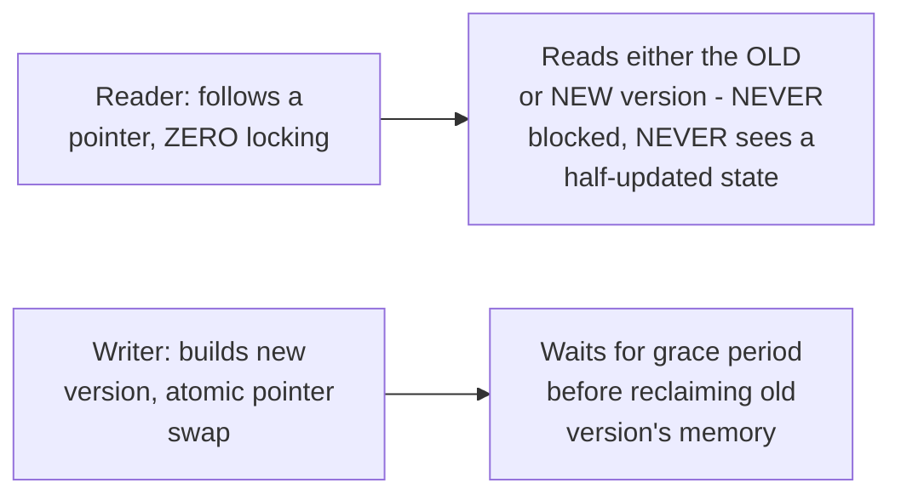

# Readers-Writers — Professional

<!-- level-focus -->
At professional level, focus on this question:

> How does RCU (Read-Copy-Update) avoid the reader/writer starvation
> trade-off from `senior.md` entirely, for read-mostly workloads?

Prerequisite: [`senior.md`](senior.md).

---

## RCU: readers never wait, ever, at all

Recall RCU from the Locking & Concurrency Control professional page's
Linux kernel toolkit discussion: readers traverse data structures with
**zero locking, zero atomics on the hot path** — they simply follow
pointers. Writers create an entirely **new** version of the data, publish
it via a single atomic pointer swap, and wait for a **grace period**
(all CPUs confirmed to have passed through a quiescent state) before
reclaiming the old version's memory. This sidesteps `senior.md`'s entire
reader/writer-preference trade-off by construction: **readers never
compete with writers for a lock at all**, because a reader is always
reading either the old or new version, never a half-updated one, and
never blocked.

## The trade-off RCU makes instead

RCU's cost model is fundamentally different from `senior.md`'s lock-based
trade-off: instead of choosing between reader-starves-writer or
writer-blocks-readers, RCU pays its cost **entirely on the write side** —
a writer must wait out a grace period before reclaiming old memory
(potentially milliseconds), and memory usage temporarily grows (old and
new versions both exist during the grace period). This is precisely why
RCU is the right professional-level answer specifically for **read-mostly**
workloads (routing tables, configuration, mount tables in the Linux
kernel) where write frequency is low enough that the grace-period cost is
easily amortized, but would be a poor fit for a write-heavy workload
where paying that cost on every write would dominate.

> 🎯 **Professional-level insight:** RCU doesn't "solve" the reader-writer
> starvation trade-off from `senior.md` — it **restructures** the
> problem entirely by moving all synchronization cost onto the write
> path and eliminating it from the read path completely, which is only a
> good trade when reads vastly outnumber writes. This mirrors the exact
> "know your read:write ratio before choosing a mechanism" principle from
> the NoSQL Modeling professional page's RCU discussion, applied here at
> the language/systems-programming level instead of the distributed-
> database level.

## Test yourself

1. Why can an RCU reader never see a "half-updated" data structure, even
   with zero locking on the read path?
2. Why does RCU's grace-period-based memory reclamation make it a poor
   fit for a write-heavy workload?
3. Compare RCU's cost model to `senior.md`'s writer-preference lock —
   which side (reads or writes) pays the coordination cost in each
   approach?

## Further Reading

- Paul McKenney — "What is RCU, Fundamentally?" (LWN.net, the canonical,
  detailed explanation of RCU's mechanics and grace periods).
- See also: [Locking & Concurrency Control — professional](../../../../databases/transaction/09-locking-and-concurrency-control/professional.md)
  (the original RCU/seqlock/per-CPU discussion this page builds on).
