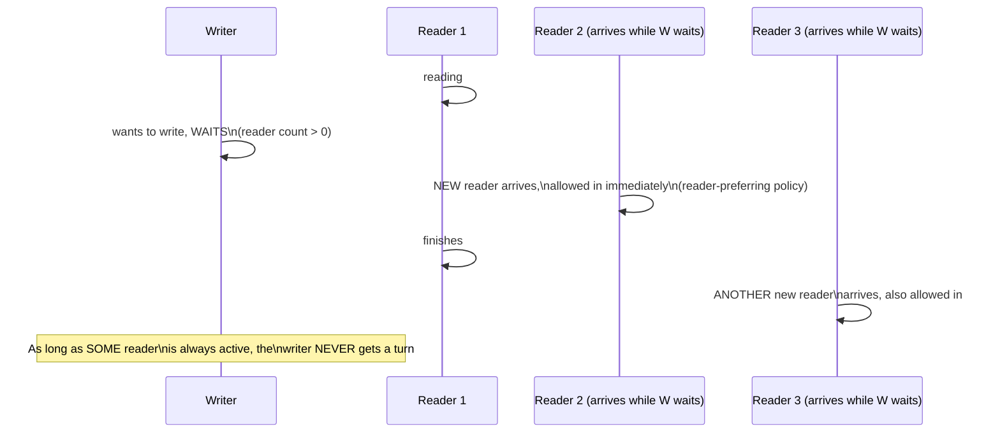
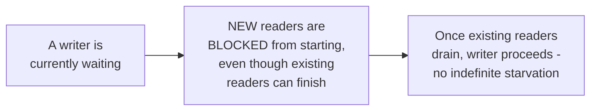

# Readers-Writers — Senior

<!-- level-focus -->
At senior level, focus on this question:

> How can a reader-preferring lock starve writers indefinitely, and what's
> the alternative?

Prerequisite: [`middle.md`](middle.md).

---

## Reader preference: writers wait behind a continuous stream of readers

`middle.md`'s implementation, as written, has this exact flaw: a writer
waits for the reader count to hit **zero**, but if new readers keep
arriving before the count ever reaches zero, the writer can wait
indefinitely — a real, documented **writer starvation** risk under
sustained high read load.

## Writer preference: block new readers once a writer is waiting

A **writer-preferring** lock adds a rule: once a writer is waiting, any
**new** reader is blocked (queued behind the writer) even if other
readers are currently active — this guarantees the writer eventually gets
its turn once the currently-active readers finish, at the cost of
potentially making new readers wait even when the writer hasn't started
yet.

> 🎯 **Senior takeaway:** neither pure reader-preference nor pure
> writer-preference is universally correct — reader-preference risks
> writer starvation under sustained read load; writer-preference can
> reduce read throughput under sustained write pressure. Most production
> reader-writer lock implementations (Java's `ReentrantReadWriteLock`,
> for instance) use a **fair** policy that interleaves waiting readers and
> writers roughly in arrival order, avoiding indefinite starvation in
> either direction as the practical default.

## Test yourself

1. Walk through exactly how a continuous stream of new readers can starve
   a waiting writer under a reader-preferring policy.
2. Why does writer-preference's "block new readers once a writer is
   waiting" rule prevent this starvation?
3. What downside does writer-preference introduce for read throughput
   under a workload with frequent writes?

Continue to [`professional.md`](professional.md) to see RCU as a
production mechanism that avoids this trade-off differently.
