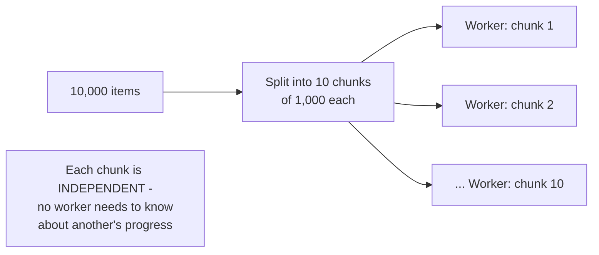

# Fan-Out / Fan-In — Junior

<!-- level-focus -->
At junior level, focus on this question:

> Why does splitting one task across multiple independent workers give
> you real parallelism, and what makes a task splittable this way?

---

## Fanning out: independent sub-tasks run concurrently

```python
import concurrent.futures

def process_chunk(chunk):
    return sum(x * x for x in chunk)

chunks = [data[i:i+1000] for i in range(0, len(data), 1000)]

with concurrent.futures.ThreadPoolExecutor(max_workers=4) as executor:
    results = list(executor.map(process_chunk, chunks))  # FAN-OUT
```



Fan-out works specifically because each chunk's processing is
**independent** — worker 2 doesn't need any information from worker 1's
work to do its own. This is the exact "embarrassingly parallel" data-
parallelism shape referenced throughout the parallel-programming topics
in this same folder.

> 🎓 **Takeaway:** fan-out gives you real parallelism precisely when the
> work naturally decomposes into independent pieces — if sub-tasks
> genuinely depend on each other's results, you don't have a fan-out
> opportunity at all, you have a sequential dependency chain.

## Test yourself

1. Why does independence between chunks matter for fan-out to actually
   provide parallelism benefit?
2. Give an example of a task that CANNOT be naively fanned out because
   its sub-parts depend on each other.
3. If you fan out 10,000 items across 4 workers, roughly how many items
   would each worker handle, and why does uneven chunk sizes matter for
   overall completion time?

Continue to [`middle.md`](middle.md).
