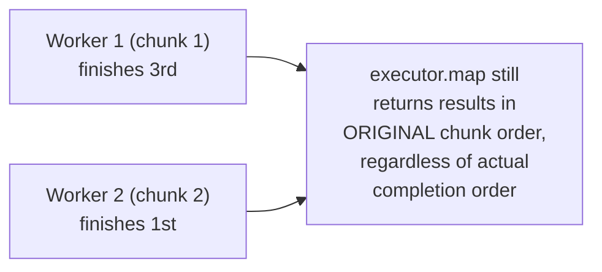
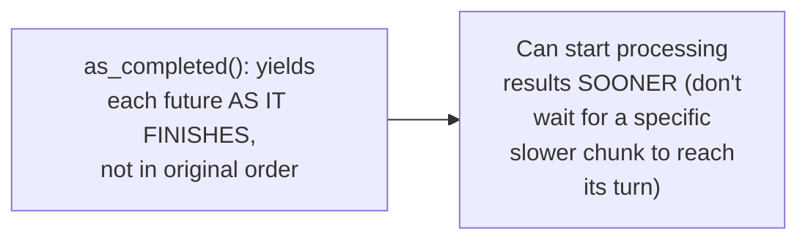

# Fan-Out / Fan-In — Middle

<!-- level-focus -->
At middle level, focus on this question:

> How do you merge fanned-out results back together without losing data
> or introducing an incorrect order?

Prerequisite: [`junior.md`](junior.md).

---

## Order-preserving fan-in: track which result belongs where

```python
import concurrent.futures

with concurrent.futures.ThreadPoolExecutor(max_workers=4) as executor:
    # executor.map PRESERVES the input order in its output,
    # even though workers complete in a different, unpredictable order
    results = list(executor.map(process_chunk, chunks))
    final = [item for chunk_result in results for item in chunk_result]
```



Most fan-out utilities (Python's `executor.map`, similar constructs in
other languages) preserve **input order** in the output, internally
tracking which future corresponds to which original input position —
even though workers may finish in a completely different, unpredictable
order due to varying chunk processing times.

## Order-agnostic fan-in: process results as they arrive

```python
futures = [executor.submit(process_chunk, c) for c in chunks]
for future in concurrent.futures.as_completed(futures):
    result = future.result()   # processes in COMPLETION order, not input order
    handle_result(result)
```



> 🎓 **Takeaway:** choose order-preserving fan-in when downstream logic
> genuinely needs results in original order; choose order-agnostic
> (`as_completed`) fan-in when you just need "all results eventually,
> processed as soon as available" — the latter can reduce latency by not
> waiting for a specific slow chunk before processing faster ones that
> finished earlier.

## Test yourself

1. Why does `executor.map` return results in input order even though
   workers may finish in a different order?
2. When would order-agnostic fan-in (`as_completed`) provide a real
   latency benefit over order-preserving fan-in?
3. Design a scenario where preserving input order in the merged result
   is genuinely necessary for correctness (not just convenience).

Continue to [`senior.md`](senior.md).
