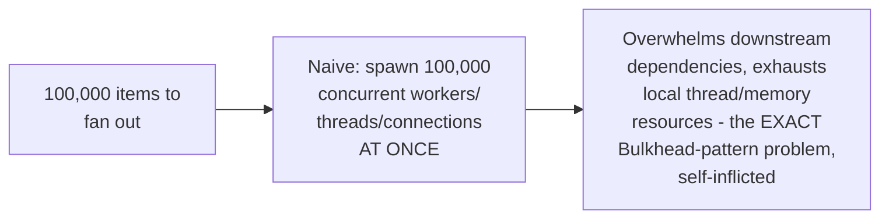
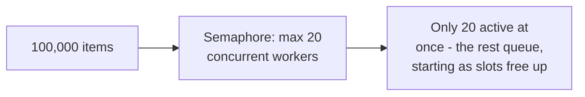

# Fan-Out / Fan-In — Professional

<!-- level-focus -->
At professional level, focus on this question:

> Why must production fan-out always bound its concurrency, and how does
> this connect to the bulkheading and semaphore-based concurrency limiting
> covered elsewhere in this tree?

Prerequisite: [`senior.md`](senior.md).

---

## Unbounded fan-out is a self-inflicted denial-of-service



Fanning out to a number of concurrent workers equal to your **input
size** (rather than a deliberately chosen concurrency limit) recreates
exactly the resource-exhaustion risk from the Bulkhead reliability
pattern — 100,000 concurrent database connections or API calls will
overwhelm almost any downstream dependency, and likely exhaust local
resources (threads, memory, file descriptors) first.

## Bounded fan-out via a semaphore

```python
import asyncio

async def bounded_fan_out(items, worker_fn, max_concurrency=20):
    semaphore = asyncio.Semaphore(max_concurrency)

    async def bounded_worker(item):
        async with semaphore:   # only N can hold this at once
            return await worker_fn(item)

    return await asyncio.gather(*[bounded_worker(i) for i in items])
```



This is the exact semaphore-based bulkhead mechanism from the Bulkhead
professional page, applied at the in-process fan-out scale — the
concurrency limit should be chosen based on the actual downstream
dependency's capacity (per the Queue-Based Load Leveling professional
page's consumer-sizing math), not left at "however many items happen to
exist."

## Production checklist (staff-level)

1. **Always bound fan-out concurrency explicitly** (a semaphore, a
   fixed-size thread/worker pool) rather than spawning one worker per
   input item — this is the direct, in-process application of the
   Bulkhead pattern's resource-protection principle.
2. **Size the concurrency limit based on the actual downstream
   dependency's capacity**, using the same sizing math as connection
   pooling and queue-based load leveling — not an arbitrary round number.
3. **Combine bounded concurrency with the fail-fast/partial-success
   decision (`senior.md`)** explicitly — a bounded semaphore doesn't
   change which failure-handling strategy is correct, but both decisions
   should be made together as part of one coherent fan-out design.
4. **Monitor actual achieved concurrency and queue depth (items waiting
   for a semaphore slot)** for any production fan-out operation — this
   reveals whether your chosen concurrency limit is well-tuned against
   real downstream capacity.
5. **In a code review for a new fan-out implementation, check for an
   explicit concurrency bound** as a required, non-negotiable element —
   unbounded fan-out is a common, easy-to-introduce production incident
   risk that's simple to catch in review.

## Cheat Sheet

```text
+------------------------------------------------------------------+
|              FAN-OUT / FAN-IN — INTERNALS & SCALE                    |
+------------------------------------------------------------------+
| Unbounded fan-out (one worker per input item) recreates the exact     |
| Bulkhead-pattern resource-exhaustion risk, self-inflicted - can        |
| overwhelm downstream dependencies AND exhaust local resources          |
| (threads, memory, file descriptors)                                   |
+------------------------------------------------------------------+
| Fix: bound concurrency via a SEMAPHORE (or fixed-size worker pool) -  |
| size the limit against actual downstream capacity, same math as        |
| connection pooling / queue-based load leveling consumer sizing         |
+------------------------------------------------------------------+
| ALWAYS bound fan-out concurrency explicitly in production code -      |
| check for this in code review as a required element                   |
+------------------------------------------------------------------+
```

## Test yourself

1. Why does fanning out to one worker per input item recreate the
   Bulkhead pattern's resource-exhaustion risk?
2. How would you determine the right concurrency limit for a fan-out
   operation calling a downstream API with a known rate limit of 500
   requests/second?
3. Design a code-review checklist item that would catch an unbounded
   fan-out implementation before it reaches production.

## Further Reading

- See also: [Bulkhead — professional](../../../../distributed-system/20-reliability-patterns/02-bulkhead/professional.md),
  [Queue-Based Load Leveling — professional](../../../../distributed-system/20-reliability-patterns/09-queue-based-load-leveling/professional.md).
