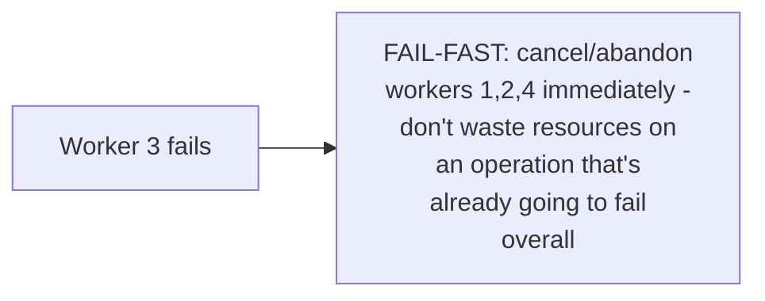
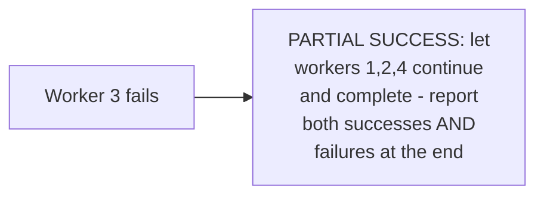

# Fan-Out / Fan-In — Senior

<!-- level-focus -->
At senior level, focus on this question:

> When one of N fanned-out workers fails, what should happen to the
> other N-1, and to the overall operation?

Prerequisite: [`middle.md`](middle.md).

---

## Fail-fast: cancel everything the instant one fails

```python
with concurrent.futures.ThreadPoolExecutor(max_workers=4) as executor:
    futures = [executor.submit(risky_task, c) for c in chunks]
    try:
        results = [f.result() for f in futures]  # first exception propagates
    except Exception:
        for f in futures:
            f.cancel()  # attempt to cancel remaining work
        raise
```



**Fail-fast** is appropriate when the overall operation's semantics
require **all** sub-tasks to succeed for the result to be meaningful at
all (e.g. "process every row in this batch, all-or-nothing") — continuing
the other workers wastes resources on work that will be discarded anyway.

## Partial success: collect what succeeded, report what failed

```python
results = {"succeeded": [], "failed": []}
for future in concurrent.futures.as_completed(futures):
    try:
        results["succeeded"].append(future.result())
    except Exception as e:
        results["failed"].append(e)
```



**Partial success** is appropriate when sub-tasks are genuinely
independent and useful on their own (e.g. "resize these 10 images" —
9 succeeding is still valuable even if 1 fails) — matching this page's
choice to `junior.md`'s independence requirement for fan-out itself.

> 🎯 **Senior takeaway:** the fail-fast-vs-partial-success decision should
> be made deliberately based on whether the fanned-out sub-tasks' results
> are only meaningful together (fail-fast) or independently valuable
> (partial success) — this is the exact same all-or-nothing-vs-independent-
> value distinction that determines saga design (per the Compensating
> Transaction reliability pattern) applied at the in-process,
> single-operation scale instead of a distributed transaction's scale.

## Test yourself

1. Give an example where fail-fast is clearly the right choice for a
   fanned-out operation, and one where partial success is clearly right.
2. Why does continuing to run other workers after one has already failed
   waste resources specifically in the fail-fast scenario?
3. Design the failure-handling strategy for a fan-out operation
   resizing 100 images, where a small percentage of images might have
   corrupted data.

Continue to [`professional.md`](professional.md) to design fan-out with
bounded concurrency at production scale.
