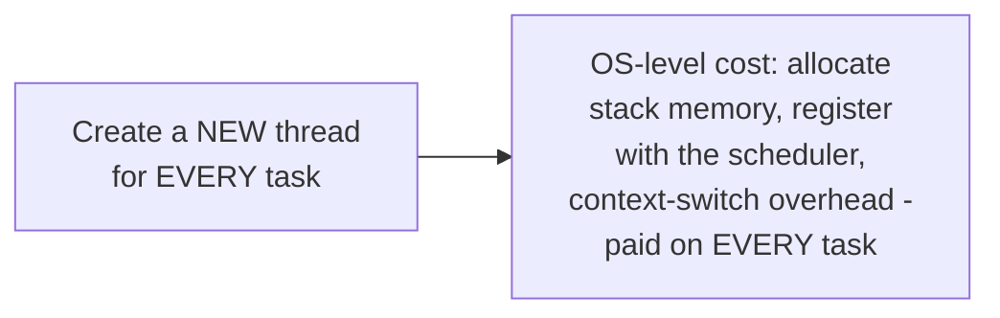
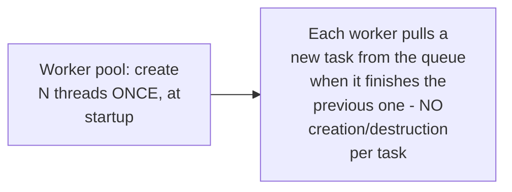

# Worker Pool — Junior

<!-- level-focus -->
At junior level, focus on this question:

> What does creating a new thread or process for every single unit of
> work actually cost, and why does that add up?

---

## Thread/process creation is not free

Creating an OS thread involves real, measurable overhead — memory
allocation for its stack, kernel bookkeeping to register it with the
scheduler — small per-thread, but if you're processing thousands or
millions of small tasks, creating (and destroying) a thread per task adds
this cost **every single time**, dominating the actual useful work for
small, frequent tasks.

## A worker pool pays this cost once, reuses workers forever

A worker pool creates a **fixed** number of long-lived workers once, at
startup — each worker repeatedly pulls the next available task from a
shared queue and processes it, reusing the same thread/process
indefinitely rather than paying creation cost per task.

> 🎓 **Takeaway:** the worker pool pattern amortizes thread/process
> creation cost across many tasks — exactly analogous to connection
> pooling's amortization of connection-setup cost (per the Connection
> Pooling professional page), just for compute resources instead of
> network connections.

## Test yourself

1. Why does creating a thread per task become a real, measurable cost at
   high task volume, even though a single thread creation is fast?
2. Why is this the same amortization principle as connection pooling?
3. For a program processing 10 large, long-running tasks total, would a
   worker pool provide meaningful benefit over just creating 10 threads
   directly? Why or why not?

Continue to [`middle.md`](middle.md).
