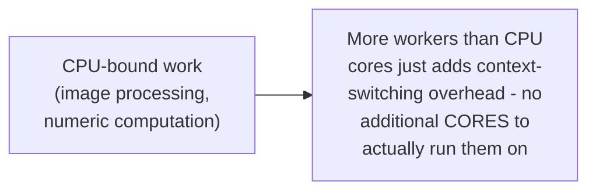
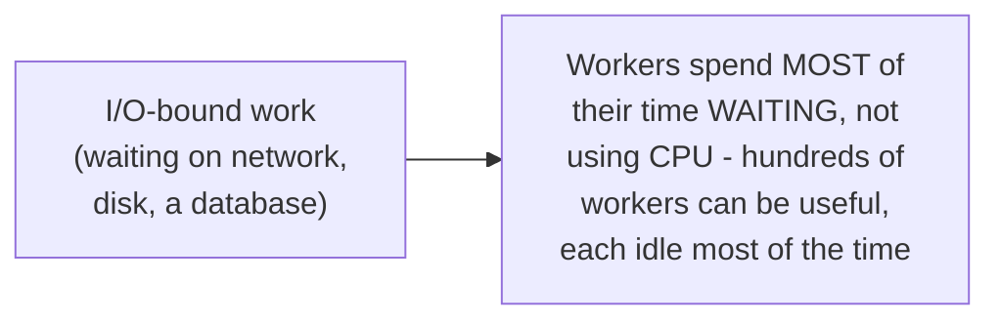

# Worker Pool — Senior

<!-- level-focus -->
At senior level, focus on this question:

> Why does the right pool size differ dramatically between CPU-bound and
> I/O-bound work?

Prerequisite: [`middle.md`](middle.md).

---

## CPU-bound: pool size ≈ core count

If a task is genuinely CPU-bound (spends its time computing, not
waiting), having more worker threads than physical CPU cores provides no
benefit — there's no additional compute capacity for the extra workers
to use, and the OS just context-switches between more threads than
necessary, adding overhead without adding throughput. Pool size should
be roughly the core count (or `core_count - 1`, leaving room for the
main thread/OS).

## I/O-bound: pool size can vastly exceed core count

If a task is I/O-bound (spends most of its time **waiting** on a network
call, disk read, or database query), a worker sitting idle during that
wait isn't consuming CPU — you can profitably run far more workers than
CPU cores, because most of them are waiting, not computing, at any given
moment. This is the exact CPU-bound-vs-I/O-bound distinction from the
Task Queues professional page's concurrency-model discussion (prefork vs.
async/eventlet), applied here to raw worker pool sizing.

> 🎯 **Senior takeaway:** "how many workers should I use" has no single
> correct answer — it depends entirely on whether the work is CPU-bound
> (size ≈ core count) or I/O-bound (size can be much larger, driven by
> how much concurrent waiting you need to sustain, per the Queue-Based
> Load Leveling professional page's throughput sizing math). Mixing both
> kinds of work in one pool with one size is a common, avoidable
> performance mistake.

## Test yourself

1. Why does adding more worker threads than CPU cores fail to help a
   CPU-bound workload?
2. Why can an I/O-bound workload benefit from far more workers than CPU
   cores?
3. A single worker pool processes both CPU-heavy image resizing and
   I/O-heavy API calls. What problem does this mixing create, and how
   would you fix it?

Continue to [`professional.md`](professional.md) to see work-stealing
pools that rebalance load automatically at scale.
