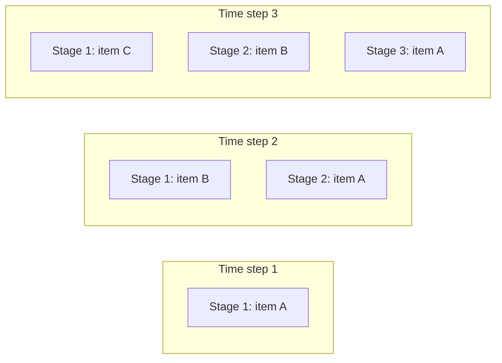
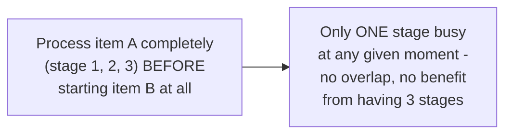

# Pipeline — Junior

<!-- level-focus -->
At junior level, focus on this question:

> Why does a pipeline process multiple items concurrently, even though
> each individual item passes through its stages sequentially?

---

## Sequential-per-item, concurrent-across-items

Each **individual item** does pass through Stage 1, then Stage 2, then
Stage 3, in order — but once item A moves to Stage 2, Stage 1 is free to
start working on item B immediately, rather than waiting for item A to
finish the entire pipeline first. By time step 3, all three stages are
simultaneously busy, each on a different item — this is real concurrency,
even though no single item's processing is reordered.

## Compare to a naive, fully-sequential approach

> 🎓 **Takeaway:** a pipeline's concurrency comes from **overlapping**
> different items' progress through different stages simultaneously —
> not from parallelizing any single item's work. This is exactly the
> instruction-pipelining concept from CPU architecture, applied at the
> software task level instead of CPU instruction execution.

## Test yourself

1. Why does item A moving to Stage 2 free up Stage 1 to start on item B,
   rather than Stage 1 needing to wait?
2. Once the pipeline reaches "steady state" (every stage busy), how many
   items are being actively processed simultaneously, given a 3-stage
   pipeline?
3. Why would processing each item completely before starting the next
   (no pipelining at all) waste the potential concurrency benefit
   entirely?

Continue to [`middle.md`](middle.md).
