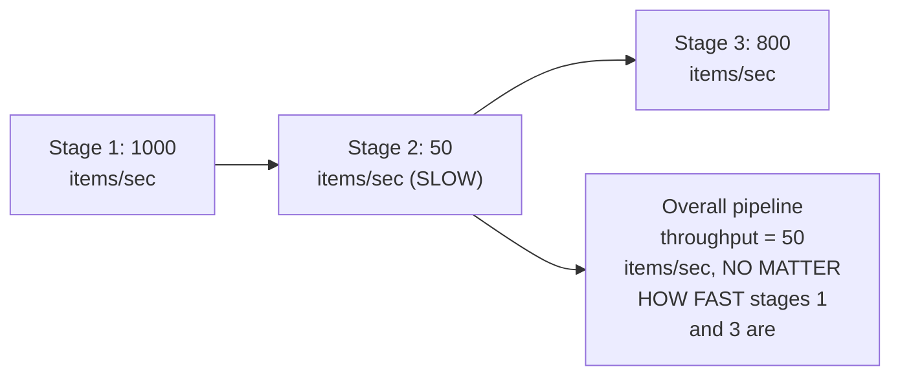
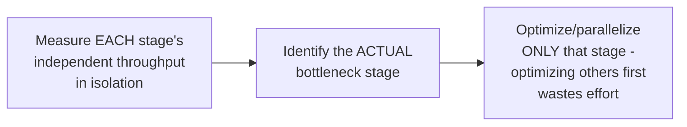

# Pipeline — Senior

<!-- level-focus -->
At senior level, focus on this question:

> Why does the slowest single stage determine the entire pipeline's
> maximum throughput, regardless of how fast the other stages are?

Prerequisite: [`middle.md`](middle.md).

---

## Throughput is bounded by the bottleneck stage

Even though Stage 1 could process 1000 items/second and Stage 3 could
process 800/second, the pipeline's **overall** steady-state throughput
can never exceed Stage 2's 50 items/second — Stage 1 will eventually fill
Stage 2's input queue and block (per `middle.md`'s back-pressure), and
Stage 3 will spend most of its time idle waiting for Stage 2 to produce
more work. This is a direct instance of the general "system throughput is
bounded by its bottleneck resource" principle appearing throughout this
tree (query optimization's slowest join stage, a distributed system's
weakest link in delivery guarantees).

## Measuring per-stage throughput before optimizing anything

> 🎯 **Senior takeaway:** before optimizing a slow pipeline, measure each
> stage's independent throughput to identify the actual bottleneck —
> optimizing a non-bottleneck stage (making Stage 1 even faster than its
> already-plentiful 1000/sec) provides **zero** improvement to overall
> throughput, because Stage 2 was always the limiting factor. This is
> exactly the diagnostic discipline recommended in the Spark professional
> page's data-skew diagnosis: identify the actual straggler/bottleneck via
> measurement before assuming where the problem is.

## Test yourself

1. Why does making Stage 1 twice as fast provide zero improvement to the
   pipeline's overall throughput in the example above?
2. How would you measure each stage's independent throughput to identify
   the actual bottleneck in a real pipeline?
3. Once you've identified Stage 2 as the bottleneck, what are your
   options for improving overall pipeline throughput?

Continue to [`professional.md`](professional.md) to see how balancing
stage parallelism at scale addresses this bottleneck.
