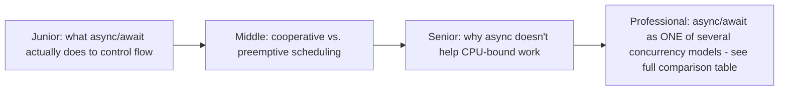

# Async/Await (Concurrency Model Overview)

> This folder is about *concurrency models* generally; async/await is one
> such model, covered here as an overview bridging into the dedicated,
> much deeper [Async Programming](../../async-programming/README.md)
> track — read this page for the concurrency-model framing, then go there
> for the full depth (event loops, coroutines, cancellation, runtimes).



```mermaid
flowchart LR
    Sync["Synchronous call:\nBLOCKS the thread\nuntil it returns"] -.-.- Async["async/await:\nSUSPENDS this task,\nthread is FREE to run\nsomething else meanwhile"]
```

## Choose a level

| Level | Guide | You are done when |
|---|---|---|
| Junior | [What async/await does to control flow](junior.md) | You can explain the difference between a blocking call and an `await`ed call. |
| Middle | [Cooperative vs. preemptive scheduling](middle.md) | You can explain why an async task must explicitly yield control, unlike a preemptively-scheduled thread. |
| Senior | [Why async doesn't help CPU-bound work](senior.md) | You can explain why wrapping a CPU-heavy function in `async def` provides no speedup. |
| Professional | [Async/await among other concurrency models](professional.md) | You can place async/await alongside actors, CSP, and shared-memory threading in the broader concurrency-model landscape. |

## Practice rule

Before reaching for `async`/`await`, confirm your bottleneck is actually
**waiting** (network, disk, a timer) — not **computing**. If it's
computing, async/await provides zero benefit; you need the parallel-
programming track's tools instead.

## Related

- [Async Programming (full track)](../../async-programming/README.md)
- [Parallel Programming (full track)](../../parallel-programming/README.md)
