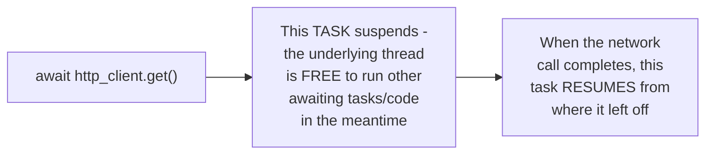

# Async/Await — Junior

<!-- level-focus -->
At junior level, focus on this question:

> What's the actual difference between a blocking call and an `await`ed
> call, in terms of what the thread does while waiting?

---

## Blocking: the thread does nothing else until the call returns

```python
def fetch_sync():
    response = requests.get(url)  # thread BLOCKS here, does nothing else
    return response

fetch_sync()  # thread frozen for however long this network call takes
```


## `await`: the thread is freed to do other work while waiting

```python
async def fetch_async():
    response = await http_client.get(url)  # SUSPENDS this task,
                                              # thread is FREE meanwhile
    return response
```



`await` doesn't block the thread — it **suspends** the current async
task, letting the thread (running an event loop, per
[Async Programming](../../async-programming/README.md)) go do other
useful work, and resumes this specific task later once the awaited
operation completes.

> 🎓 **Takeaway:** the whole value of async/await is that a single thread
> can have **many** tasks in flight simultaneously, each waiting on
> something, without needing a dedicated thread per task — this is the
> C10K-problem-solving idea covered in depth in the Async Programming
> track's junior page.

## Test yourself

1. Why does a blocking call prevent the thread from doing anything else,
   while an `await`ed call doesn't?
2. What happens to an async task's local variables and execution
   position while it's suspended, waiting for an awaited operation?
3. Why would running 10,000 blocking network calls typically require
   10,000 threads, while 10,000 `await`ed calls might need just one?

Continue to [`middle.md`](middle.md).
