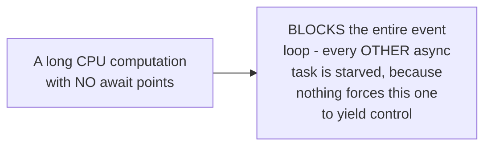
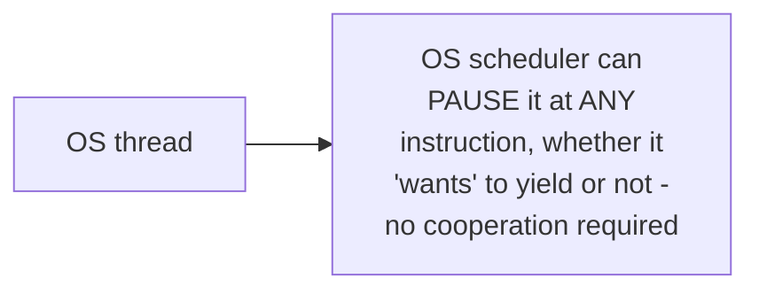

# Async/Await — Middle

<!-- level-focus -->
At middle level, focus on this question:

> Why must an async task explicitly yield control at `await` points,
> unlike a preemptively-scheduled OS thread?

Prerequisite: [`junior.md`](junior.md).

---

## Cooperative scheduling: tasks must voluntarily give up control

```python
async def bad_task():
    result = 0
    for i in range(100_000_000):
        result += i  # NO await anywhere in this loop -
                      # this task NEVER yields control,
                      # blocking every other async task
    return result
```



Async tasks run on a **cooperatively scheduled** event loop — control only
switches to another task at an explicit `await` point (or equivalent
yield). If a task runs a long computation with no `await` inside it, it
**never** yields, and every other async task sharing that thread is
starved for the entire duration — a real, common bug in async code
(this is `senior.md`'s subject in more depth).

## Preemptive scheduling: the OS switches threads without their cooperation



By contrast, OS threads are **preemptively** scheduled — the OS can pause
a thread at any point (a timer interrupt) and run a different thread,
with no cooperation needed from the running thread at all. This is
exactly why a CPU-bound loop in a regular thread doesn't starve other
threads the way it starves other async tasks: the OS forcibly interrupts
it periodically regardless.

> 🎓 **Takeaway:** cooperative scheduling (async/await) trades "no
> forced-interruption overhead" for "a task that doesn't yield can starve
> everything else sharing its thread" — this is a fundamental design
> trade-off, not a bug in any specific async runtime, and it's the exact
> reason mixing CPU-heavy work into async code (without explicitly
> offloading it) is a well-documented anti-pattern.

## Test yourself

1. Why does a long CPU loop with no `await` inside it block every other
   async task sharing the same thread?
2. Why doesn't the equivalent CPU-bound loop in a regular OS thread cause
   the same problem for other OS threads?
3. What would you need to do to run a genuinely CPU-heavy computation
   from within async code without starving other tasks?

Continue to [`senior.md`](senior.md).
