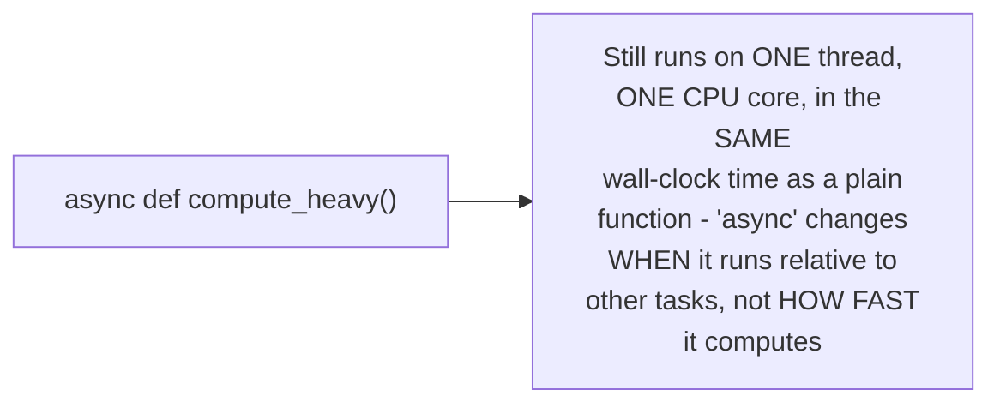

# Async/Await — Senior

<!-- level-focus -->
At senior level, focus on this question:

> Why does wrapping a CPU-heavy function in `async def` provide zero
> speedup, and what should you do instead?

Prerequisite: [`middle.md`](middle.md).

---

## `async def` doesn't parallelize anything by itself

```python
async def compute_heavy():  # marking it async changes NOTHING
    result = 0               # about how the CPU work executes -
    for i in range(100_000_000):  # it still runs on ONE thread,
        result += i           # ONE core, taking the SAME time
    return result
```



`async`/`await` is a concurrency mechanism for **waiting**, not a
parallelism mechanism for **computing** — this is exactly the "async does
not accelerate CPU work" warning from this whole folder's top-level
README. Marking a CPU-bound function `async` doesn't make it run faster
or use more cores; it just determines whether it yields control to other
tasks while running (per `middle.md`, it doesn't, if it has no `await`
points).

## The fix: offload CPU work to a separate thread/process

```python
import asyncio
from concurrent.futures import ProcessPoolExecutor

async def compute_heavy_offloaded():
    loop = asyncio.get_event_loop()
    with ProcessPoolExecutor() as pool:
        result = await loop.run_in_executor(pool, cpu_heavy_function)
        # NOW it actually runs on a SEPARATE process/core,
        # and the event loop is free while waiting for it
    return result
```


> 🎯 **Senior takeaway:** to get real speedup for CPU-bound work from
> async code, you must explicitly hand it off to a genuinely parallel
> mechanism (a process pool, per the parallel-programming track) — async
> code merely lets the event loop stay responsive to *other* tasks while
> waiting for that offloaded work to complete; it does not itself make
> the CPU work any faster.

## Test yourself

1. Why does marking a function `async def` not change how fast its CPU
   computation runs?
2. Why does offloading to a `ProcessPoolExecutor` (not just any
   `await`) actually provide a real speedup for CPU-bound work?
3. Diagnose this bug report: "our async web server becomes unresponsive
   to all requests whenever a specific CPU-heavy endpoint is called."

Continue to [`professional.md`](professional.md) to place async/await
among the broader landscape of concurrency models.
