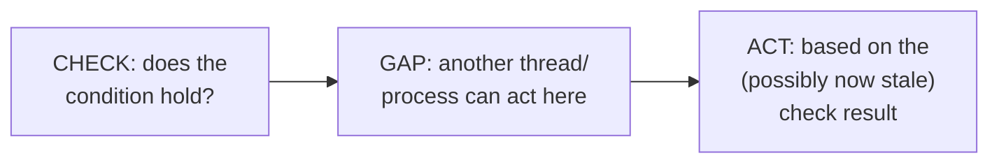
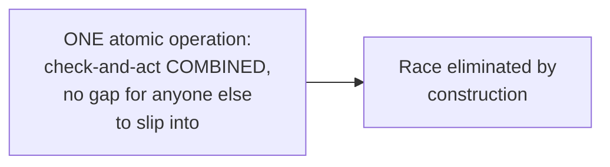

# Race Conditions — Middle

<!-- level-focus -->
At middle level, focus on this question:

> How do you identify a check-then-act race in code, and fix it with an
> atomic operation?

Prerequisite: [`junior.md`](junior.md).

---

## Recognizing the shape: check, then (separately) act

```python
# RACE: two separate operations, a window between them
if not os.path.exists(lockfile):        # CHECK
    with open(lockfile, "w") as f:      # ACT
        f.write("locked")
# Another process could create lockfile between the check and the act -
# BOTH processes proceed believing they got the lock
```



Any code shaped as "check a condition, then take an action based on it,
as two separate steps" is vulnerable — no matter how fast the gap is, a
concurrent actor can slip in during it.

## The fix: a single atomic operation combining check and act

```python
import os

try:
    fd = os.open(lockfile, os.O_CREAT | os.O_EXCL)  # ATOMIC:
    # creates the file ONLY IF it doesn't already exist,
    # as ONE indivisible OS-level operation - no gap at all
except FileExistsError:
    pass  # someone else already has the lock
```



This is the exact same pattern as `INSERT ... ON CONFLICT DO NOTHING`
from the Idempotency Keys professional page, and `compare-and-swap` from
lock-free data structures — the general fix for any check-then-act race
is finding (or building) a single, indivisible operation that performs
both the check and the act together, so there's no window for a
concurrent actor to interfere.

> 🎓 **Takeaway:** whenever you see "check X, then act based on X" as two
> separate statements touching shared state, ask whether an atomic
> compound operation (a database's conditional write, a filesystem's
> exclusive-create flag, a compare-and-swap) can replace both steps with
> one that can't be interrupted.

## Test yourself

1. Why does `os.open(..., os.O_EXCL)` eliminate the race that a separate
   `if os.path.exists()` check followed by `open()` would have?
2. Find the check-then-act race in: `if key not in dict: dict[key] = compute()`.
   How would you fix it atomically?
3. Why is "make the check-then-act sequence faster" not a real fix for
   this race, even if it makes the race statistically rarer?

Continue to [`senior.md`](senior.md).
